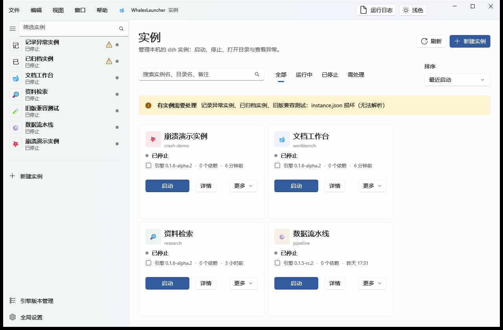
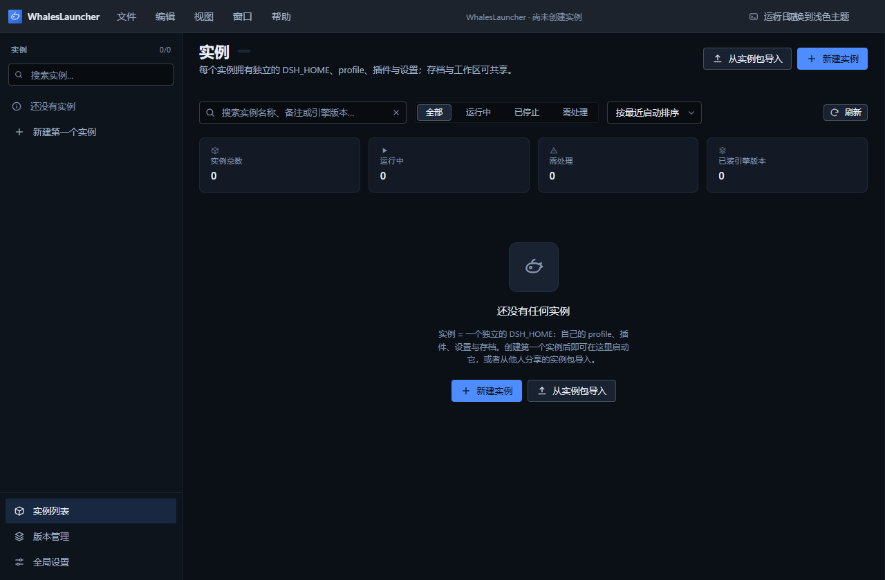
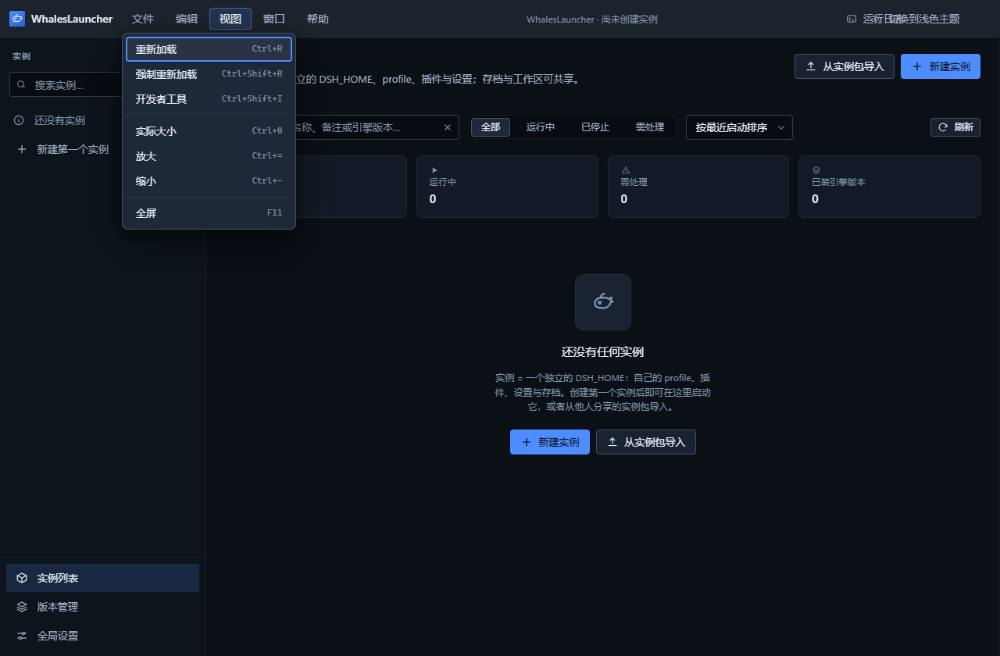
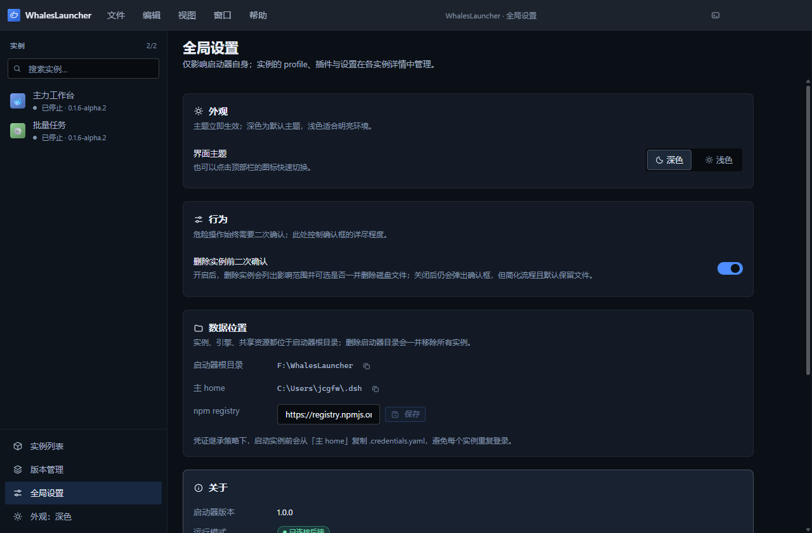

# WhalesLauncher

> **DeepSeek Harness (dsh) 的实例与版本管理启动器**
> Windows 11 / 10 x64 · **WinUI 3 (C#/XAML)** · Windows App SDK · .NET 10 · Node.js 侧车业务引擎
>
> 仓库：<https://github.com/IDKWhatID2Use/whales-launcher>
> 许可证：[Polyform Noncommercial 1.0.0](LICENSE) —— 非商业用途免费，**未经授权不得商用**
>
> 📘 **第一次用？直接看 [完整使用教程（图文）](docs/guide/README.md)** —— 从安装到日常使用，关键界面逐步配图。

---

## 这是什么

WhalesLauncher 是 **DeepSeek Harness (dsh) 的实例与版本管理启动器**：每个实例独享自己的
引擎版本、插件列表与设置，会话与工作文件夹可以互通，实例之间互不干扰。

| 概念 | 承载物 |
|---|---|
| **dsh 实例** | 一个独立 `DSH_HOME` + 一份实例元数据 |
| **dsh 引擎版本** | `engines/<版本>/node_modules/@deepseek-ai/dsh` |
| **dsh 插件** | profile 的 `dependencies` |
| **dsh 组合包** | profile 的 `dsh.profile.bundles` |
| **插件启用/禁用** | `cordis.patch.yml` 的 `disabled` |
| **实例设置** | 每实例一份 `settings.yaml` |
| **会话 + 工作文件夹** | `sessions/` × workspace 目录 |
| **隔离开关** | 会话 / 设置 / 工作区可各自独立或共享 |
| **实例包** | 可导入导出的 zip |

---

## 三条核心特性

### 1. 每个实例独享引擎版本、插件列表与设置

每个实例是一个**自包含目录**，内含专属的 `DSH_HOME`：

```
instances/<实例名>/
├── instance.json       # 启动器元数据（唯一事实源）
├── home/               # ← 该实例专属的 DSH_HOME
│   ├── profiles/<profile>/    # package.json（插件与组合包）+ cordis.patch.yml（覆盖层）
│   ├── settings.yaml          # 该实例独享的设置
│   ├── .credentials.yaml      # 凭证（可继承主 home）
│   └── sessions/              # 该实例的会话
├── workspace/          # 默认工作文件夹
└── logs/               # 启动日志
```

启动实例时，启动器以 `DSH_HOME=<实例>/home`、`cwd=<实例工作区>` 派生 dsh 进程 ——
因为 dsh 的 home 解析优先级是「显式配置 > `$DSH_HOME` > `~/.dsh`」，注入环境变量即可实现**真正的隔离**。

### 2. 存档可互通

会话与工作区支持三种模式：

| 模式 | 行为 |
|---|---|
| `local` | 使用实例自己的目录 |
| `shared` | 用 **junction** 链接到 `shared/`，多个实例共用同一份存档 |
| `inherit`（凭证） | 从主 home 同步凭证，免去每个实例重复登录 |

Windows 的 junction **不需要管理员权限**，也不需要开发者模式。

### 3. 实例之间互相运行不干扰

独立 home、独立工作目录、独立进程、独立日志。删除实例目录即彻底删除，不影响其它实例。

**自动端口避让**：Web 实例的监听端口由启动器自动分配，**不需要人工逐个指定**。
不传 `--port` 时 dsh 会硬编码落在 3080（`dsh-web-app/cordis.patch.yml` 的 `ctx.webStartup.port ?? 3080`），
因此同时启动多个实例会全部抢同一个端口、只有一个能起来 —— 本机制消除的正是这一点。

- 每个实例有**期望端口**（手写的 `--port` 或上次分配到的端口），被占用时在 **3080–3179** 内自动避让；
- 并发启动时靠**进程内同步预留 + 操作系统绑定探测**保证不会选中同一端口（不是"概率上不会撞"）；
- 整个区间都被占满时回落 **`--port 0`**，由内核分配 —— 因此端口耗尽也不会变成启动失败；
- 各实例的实际端口记录在**实例日志**、**界面（卡片统计项 / 详情页「监听端口」）**
  与**台账** `<root>/cache/ports.json` 三处；
- 非 Web 模板（headless / sdk / acp）**一个参数都不加**（`--port` 只有 Web 应用认，传过去会被当成未知选项）；
- `instance.json` 的 schema **未改动**，台账独立存放，因此不触发任何迁移。

完整设计与边界情况见 [自动端口分配设计说明](docs/design/port-allocation.md)。

---

## 界面

界面是 **原生 WinUI 3 桌面应用**（C# / XAML，Windows App SDK），控件与视觉令牌全部取自
[`microsoft-ui-xaml`](https://github.com/microsoft/microsoft-ui-xaml) 官方体系 ——
颜色、字号、圆角一律走 WinUI 内置 `{ThemeResource ...}`，**不自建色板、不硬编码 hex**：

- **原生窗口 + 系统标题栏**。标题栏用官方 `TitleBar` 控件并入客户区（`ExtendsContentIntoTitleBar`），
  窗口控制按钮由 Windows 绘制，因此原生 hover / Snap Layouts / 最大化图标切换全部保留。
- **Mica 窗口底面**（系统支持时启用；Windows 10 或关闭透明效果时自动退回实色兜底层，不影响启动）。
- **`NavigationView` 左侧导航 + `Frame` 内容区**，页面切换带动画与面包屑。
- **深浅双主题**：主题按钮在标题栏内切换。注意：当前契约里 `LauncherConfig.theme` 只有
  `'dark' | 'light'` **没有"跟随系统"**，因此界面上明确写着"不跟随系统"——这是如实呈现的契约缺口，
  不是漏做（见[交付报告](docs/winui3-重构交付报告.md)「遗留问题」）。
- **应用内 `MenuBar` 菜单**取代系统菜单栏；快捷键由 XAML `KeyboardAccelerator` 声明。
- **日志渲染有硬上限**：增量渲染 + 行数上限，日志洪峰下不会卡死 UI。
- **可访问性**：所有状态都有**文字**（不只靠颜色），`AutomationProperties` 齐备，
  这也是渲染层 UI 自动化测试能按名称精确定位控件的前提。



<details>
<summary>更多截图</summary>

**空态引导**



**应用内菜单（Fluent 浮层）**



**全局设置**



</details>

---

## 功能一览

- **实例管理**：卡片网格、搜索/排序/筛选、创建向导（四步）、重命名、删除（含目录清理）、打开各类文件夹
- **引擎版本管理**：枚举本机已装版本、从 npm 查询可安装版本、安装（实时日志）、卸载（占用保护）
- **插件管理**：组合包开关、插件安装/卸载（走 `dsh plugin` CLI，与 dsh 的写锁一致）
- **设置编辑**：`settings.yaml` 编辑器（行号、Ctrl+S、非空校验）
- **存档管理**：会话列表（倒序、体积）、打开所在文件夹
- **启动与停止**：实时日志流（stdout/stderr 分色、自动滚动、上滚暂停）、运行计时器、**自动端口避让**（多实例同时运行互不抢端口，实际端口写入日志/界面/台账）、web 实例自动探测地址并可一键打开
- **实例包**：导出为 zip、从 zip 导入
- **全局设置**：主题、主题色、Node 运行时探测（含手动指定与重新检测）
- **直接启动**：双击 `.bat` 即用，静默启动 `.vbs`，一键建桌面/开始菜单快捷方式
- **质量保障**：桥接冒烟 141 项断言、C# 桥接客户端自验 62 项、**渲染层 UI 自动化测试**（逐页覆盖 8 个页面）、逐页视觉审计截图

---

## 安装与运行

### 环境要求

| 组件 | 版本 | 用途 |
|---|---|---|
| **Windows 10/11 x64** | 10.0.17763 及以上 | Mica 与原生窗口按钮需要 Windows 11；Windows 10 自动退回实色底面 |
| **.NET 10 桌面运行时** | 10.x | 运行已构建的应用（若自行构建则需 **.NET 10 SDK**） |
| **Node.js** | ≥ 22（本项目在 26 上验证） | 侧车业务引擎。**不必预装** —— 一个都没有时，环境自检会问一次后自动下载官方 v22 LTS 便携版到 `<根>\runtime\node\`（约 30MB，自带 npm）；你自己装的 Node 永远优先沿用 |
| **独立的 Node.js** | ≥ 20 用于跑 dsh 实例 | 可以与上面同一个 |

> **为什么实例必须有独立的 Node.js**
> dsh 依赖原生模块 `node-addon-require-builtin` 从 V8 内部取 Node 内建模块，其实现**按运行时
> 指纹白名单**匹配。若用非官方 Node 运行时（例如 Electron 内置 Node 的
> `V8 14.6.202.26-electron.0`）跑 dsh，指纹不在支持列表内，启动会直接失败：
>
> ```
> Error: dsh: host preparation failed: node-addon-require-builtin unsupported:
>   Unsupported/no-context (unsupported Electron runtime fingerprint: ...)
> ```
>
> 因此启动器**探测并调用真正的 Node.js**（`src/core/node-runtime.ts`）。解析顺序：
> `$WHALES_NODE_PATH` → `launcher.json` 的 `nodePath` → 系统 `PATH` → 常见安装位置
> （nvm-windows / Volta / fnm / 官方安装包）。每个候选都会**实际执行一次探针**
> （`node -e` 读取 `process.versions`）后才判定可用，绝不按路径名猜测。
> 界面入口：**全局设置 → Node 运行时**（可看探测结果、手动指定、重新检测）。
>
> 侧车进程同样需要 Node：C# 侧以 `node dist/bridge/server.cjs --home <root>` 拉起它。
> **一个 Node 都没有时不必手工处理**：首次启动的环境自检会问一次，然后自动下载官方
> v22 LTS 便携版到 `<根>\runtime\node\`（校验官方 SHA-256，免管理员权限、不改系统设置、
> 自带 npm）；官方源不可达时回退 npmmirror 镜像。之后每次启动只做本地检查，不再联网。

### 首次安装

从仓库克隆 —— 项目不依赖固定盘符或路径，放在任意目录都可以：

```powershell
git clone https://github.com/IDKWhatID2Use/whales-launcher.git
cd whales-launcher
npm install          # 只装构建桥接所需的依赖（esbuild / typescript / js-yaml / adm-zip）
```

> 本项目**不再有 `postinstall`**：旧前端时代那个自动铺设 Electron 运行时的步骤已随 Electron 一起移除。

### 构建

```powershell
npm run build        # = build:bridge && build:app
npm run build:bridge # 只打桥接：scripts/build-bridge.mjs -> dist/bridge/server.cjs
npm run build:app    # 只打应用：desktop/build-app.ps1（带命名 Mutex 串行化）
```

`npm run build:app` 走 `desktop/build-app.ps1`，它解决三件反复消耗团队时间的事：

1. **并发构建互相踩 `obj\`**（`CS2012 ... being used by another process`）→ 用命名 Mutex
   `Global\WhalesLauncherWinUI3Build` 串行化，并把锁竞争自动重试 8 次；
2. **XAML 编译器的诊断被 locale 吞掉** → 清掉 `DOTNET_CLI_UI_LANGUAGE` 与 `VSLANG`
   （两者任意一个都会让真实错误退化成误导性的 `WMC9999 资源找不到`）；
3. **`obj\` 锁竞争引发的假错误** → 自动识别并重试，而不是直接失败。

> ⚠ **不要给 `build-app.ps1` 加 `-Rebuild`**。`-t:Rebuild` 在本工程会报
> `CS2001 ... GeneratedMSBuildEditorConfig.editorconfig` —— 那是 `-t:Rebuild` 与并发构建交互的
> 产物，**不是**代码问题。该开关保留在脚本里属历史遗留，请勿使用。

构建产物：

| 产物 | 路径 |
|---|---|
| 应用 | `desktop/src/WhalesLauncher.App/bin/<配置>/net10.0-windows10.0.26100.0/win-x64/WhalesLauncher.exe` |
| 桥接 | `dist/bridge/server.cjs`（构建期断言 `src/main/**` 引用数 = 0） |

### 直接启动（双击即用）

不需要打开终端。项目根目录有三个入口：

| 入口 | 行为 | 适合谁 |
|---|---|---|
| **下载 [最新 Release](https://github.com/IDKWhatID2Use/whales-launcher/releases/latest) 的 zip** | **成品应用**：解压后双击包内 `WhalesLauncher.exe` 即可运行，**免装 .NET 运行时** | 只想用它（推荐） |
| **`启动 WhalesLauncher.bat`** | 从源码树启动（应用已构建时）；未构建会给出明确的构建提示。支持 `--build` / `--check` / `--wait` | 开发、排查问题、看诊断输出 |
| **`WhalesLauncher.vbs`** | 无控制台窗口的静默启动；启动失败会弹窗并把原因与日志路径一起给出 | 由快捷方式调用 |
| **`创建桌面快捷方式.bat`** | 在**桌面**与**开始菜单**各建一个快捷方式（指向上面那个 .vbs） | 装一次，之后从开始菜单搜索启动 |

后三个入口共享同一份实现 [`scripts/launch-app.ps1`](scripts/launch-app.ps1)：定位最新的
`WhalesLauncher.exe` → 启动 → 退出。`--check` 可以只看它会启动哪个 exe（不改动任何东西）：

```powershell
powershell -NoProfile -ExecutionPolicy Bypass -File scripts\launch-app.ps1 -Check
```

> **为什么仓库根目录没有 exe**：仓库是**源码树**，构建产物按 .NET 约定落在
> `desktop\src\WhalesLauncher.App\bin\...`。可交付的成品**只通过
> [GitHub Release](https://github.com/IDKWhatID2Use/whales-launcher/releases) 分发**
> （自包含、免装 .NET），这样仓库保持精简、克隆也不慢。
>
> 想自己产出一份可分发的包：
>
> ```powershell
> npm run build
> powershell -NoProfile -ExecutionPolicy Bypass -File desktop\publish-release.ps1
> ```
>
> `desktop/publish-release.ps1` 会把自包含产物整理成
> `artifacts/WhalesLauncher-<版本>-win-x64.zip`（含 `WhalesLauncher.exe`、中文说明与双击入口）。
> 该脚本同时记录了**为什么不能用单文件发布**（`PublishSingleFile` 与 unpackaged 的
> `EnableMsixTooling=false` 互斥，Windows App SDK 会直接报错）。

> 三个脚本入口都**必须在代码页 936 下安全**（`.bat` / `.vbs` / `.ps1` 一律纯 ASCII，中文只出现在
> 文件名里）。原因写在每个文件头：cmd 与 WSH 按活动代码页读文件，UTF-8 中文会被撕成
> 包含 `'` `"` `\` 的乱码字节并**静默破坏命令解析** —— 本项目在这上面实际踩过三次。

> **关于"过期二进制"**：启动入口**不会**自动重建。改了源码后请显式 `npm run build`
> （或 `启动 WhalesLauncher.bat --build`）。这比"悄悄用旧产物"更可预期，也让"我改的代码为什么
> 没生效"这类问题少一次排查。

### 图标

`assets/whales.ico` 由 [`scripts/make-icon.mjs`](scripts/make-icon.mjs) **程序化生成**
（自写 PNG 编码 + 缩放 + ICO 封装，零新增依赖），供窗口/任务栏与快捷方式使用，尺寸为
256 / 128 / 64 / 48 / 32 / 16。改设计就改脚本里的几何量再跑 `npm run icon`。

### 其它命令

```powershell
npm run typecheck    # TypeScript 类型检查（只覆盖保留的 src/**，零错误为通过）
npm test             # core 单元测试（17 项，exit 0 为通过）
npm run test:ui      # 渲染层 UI 自动化测试（逐页覆盖 8 个页面）—— 需要交互式桌面
npm run smoke:bridge # 桥接冒烟（141 项断言，在临时 home 上跑）
npm run audit:visual # 逐页视觉审计截图
npm run icon         # 重新生成 assets/whales.ico
npm run shortcut     # 重建桌面/开始菜单快捷方式
npm run clean        # 清理 dist/
```

> **教程截图是可复现的**：截图脚本在 `scripts/tutorial/`，逐页深链驱动真实应用窗口
> （`PrintWindow` + `PW_RENDERFULLCONTENT`，能截到 WinUI 3 的 DirectComposition 内容），
> 输出到 `docs/assets/tutorial/`。改动界面后重跑即可，不会留下过期的文档图。
> 复跑命令与「哪张图对应哪个页面、数据来自真实还是临时演示实例」见
> [`docs/assets/tutorial/CORRESPONDENCE.md`](docs/assets/tutorial/CORRESPONDENCE.md)。

---

## 目录结构（源码）

```
启动 WhalesLauncher.bat   # ← 双击即用（纯 ASCII：cmd 按活动代码页读批处理，
                          #    中文会被撕成乱码命令，详见文件头注释）
WhalesLauncher.vbs        # ← 静默启动（快捷方式指向它；同样必须纯 ASCII）
创建桌面快捷方式.bat        # ← 建桌面/开始菜单快捷方式
assets/whales.ico         # ← 应用图标（scripts/make-icon.mjs 生成，勿手改）
desktop/
├── build-app.ps1         # 应用构建入口（命名 Mutex 串行化 + obj 锁重试；勿加 -Rebuild）
├── bridge/               # Node 侧车：NDJSON over stdio 的桥接层
│   ├── server.mjs        #   服务器入口（动态 import src/core）
│   ├── validate.mjs      #   参数校验（自旧 src/main/ipc.ts 原样搬运）
│   ├── host.mjs          #   host: 宿主方法（反向请求 C#）
│   ├── events.mjs        #   log:chunk / log:state 事件推送
│   └── config-store.mjs  #   launcher.json 读写
└── src/WhalesLauncher.App/
    ├── App.xaml(.cs)     # 应用入口与后台装配
    ├── MainWindow.xaml   # 应用外壳（标题栏 / 左功能栏 / 日志抽屉 / 菜单）
    ├── Shell/            # 外壳组件（菜单构建、日志抽屉、宿主方法注册）
    ├── Views/            # 9 个页面（Instances / InstanceDetail+Detail / Engines / Wizard / Settings / About）
    ├── Controls/         # 跨页共享控件（PageHeader / ToastHost）
    ├── Services/         # CoreBridge（NDJSON 客户端）、AppState、导航、格式化、校验、对话框
    ├── Models/           # 契约镜像（src/shared/contracts.ts 的机械对应）
    └── Themes/Tokens.xaml
scripts/
├── launch-app.ps1        # 三个启动入口共用的实现（纯 ASCII）
├── build-bridge.mjs      # 打包桥接为 dist/bridge/server.cjs（含 src/main 引用数=0 断言）
├── make-icon.mjs         # 程序化生成多尺寸 ico（零依赖）
├── make-shortcut.ps1     # 建快捷方式（纯 ASCII，见文件头注释）
├── audit/                # 窗口截图工具、逐页视觉审计、桥接冒烟
├── test/                 # 渲染层 UI 自动化测试（UIA 驱动 + 逐页用例）
└── tutorial/             # 教程截图复跑脚本
src/
├── shared/contracts.ts   # 冻结契约：类型、通道表（CH）、CoreApi / WhalesApi
└── core/                 # 纯 Node/TS 引擎，无任何 UI/Electron 依赖，可独立测试
    ├── fsx.ts  paths.ts  names.ts          # 文件工具 / 路径解析 / 命名校验
    ├── instance.ts engine.ts profile.ts    # 实例 CRUD / 引擎安装 / profile 读写
    ├── plugins.ts plugin-packs.ts          # 插件增删 / 组合包
    ├── launch.ts proc.ts ports.ts          # 子进程启动 / 运行时状态 / 端口分配
    ├── saves.ts modpack.ts                 # 会话枚举 / 实例包导入导出
    └── node-runtime.ts runtime.ts          # Node 运行时探测 / 运行时信息
```

> **历史说明**：旧前端（`src/main/**` Electron 主进程、`src/preload/**`、
> `src/renderer/**` DOM 渲染层）已在 commit `ed93af9` **物理删除**，共 54 个文件。
> 上面的目录树是**替换后**的真实结构。需要查阅被删文件时用
> `git show ed93af9^:<路径>`（`ed93af9^` = 拆除前快照）。

> `logs/` 下是启动器与应用自身的日志（`.gitignore` 已排除）：应用侧诊断写在
> `logs/`，启动入口的诊断写在 `logs\launcher-console-<时间戳>.log`（保留 7 天）。

---

## 架构原则

1. **启动器不 import dsh 内部 API。** 多版本共存下各实例的 dsh 版本不同，内部 API 会漂移。
   稳定边界只有两条：**`dsh` CLI** 与**文件系统约定**。
2. **优先让 dsh 自己管理自己的目录。** 例如创建实例走
   `dsh --profile <名> --from-default-profile <模板> --dump-config` —— 它在全新 home 上完成
   profile 初始化并输出组合配置后退出，**不启动应用、不调用模型、无交互**（已实测）。
   `profiles/node_modules` 这类共享 fallback 也交给 dsh 在启动时自行建立，启动器不越权。
3. **绝不静默删数据。** 解除链接前先 `lstat` 确认是链接；共享模式切换遇冲突时保留本地并报错，
   而不是无条件覆盖。
4. **写操作原子化。** 同目录临时文件 + rename。

---

## 已知环境坑（原始开发机特有，非通用问题）

> 本节记录的是**原始开发机**的隔离沙箱环境所特有的现象（受限文件沙箱、无法访问
> github.com、命名管道被禁用等）。在普通 Windows 机器上通常不会遇到；保留于此是为了
> 说明代码里若干"看起来绕"的设计**为什么存在**。

| 现象 | 原因 | 处理 |
|---|---|---|
| `npm install` 报 `EPERM ... F:\NodeJS\node_cache` | shell 注入了 `npm_config_cache`，npm 优先级为 **命令行 > 环境变量 > 项目 .npmrc**，压过了项目配置 | 显式 `--cache F:\WhalesLauncher\.npm-cache` 并先设 `$env:npm_config_cache` |
| 构建/安装报 `spawn EPERM` | 受限沙箱禁止带管道 stdio 的 spawn（esbuild JS API 等依赖它） | 桥接打包已改用 esbuild 直接产出；安装用 `--ignore-scripts` |
| `npm test` 报 `spawn EPERM` | `node --test` 的 runner 为每个文件 spawn 带管道的子进程 | 已改用 `--test-isolation=none`（同进程运行） |
| 从裸 PowerShell 工具进程拉起的应用窗口无法交互 | 受限沙箱禁止命名管道 | 在普通终端运行；UI 自动化测试同理需要交互式桌面 |
| 实例启动即失败，stderr 含 `node-addon-require-builtin unsupported: Unsupported/no-context` | 曾经用 Electron 的 `process.execPath`（electron.exe）+ `ELECTRON_RUN_AS_NODE=1` 当 Node 跑 dsh；dsh 的原生模块只识别特定 Node 版本指纹 | **已修复**：改用真正的 Node.js（`src/core/node-runtime.ts`）。若本机 Node 不在 PATH 上，在「全局设置 → Node 运行时」指定 `node.exe`，或设 `$env:WHALES_NODE_PATH` |
| 实例启动失败，stderr 含 `EADDRINUSE ... :3080` | web profile 默认监听 3080，已被别的实例或别的程序占用 | 给该实例的启动参数加 `--port <其它端口>`（`launch.appArgs`），或先结束占用者；启动器的失败提示里也会写出来 |

---

## 验证与验收

本项目对"能跑"的定义是**机械可复现的证据**，而不是自述。全部验证入口如下。

### 四层验证

| 层 | 命令 | 当前结果 |
|---|---|---|
| 桥接契约 | `npm run smoke:bridge` | **141/141 通过**，退出码 0（临时 home 隔离） |
| 桥接运行时 | C# 客户端自验（`.probe/corebridge-verify`） | **62/62 通过**，含对真 `dist/bridge/server.cjs` 的握手 |
| C# 编译 | `npm run build:app` | 退出码 0，**0 错误** |
| 渲染层 | `npm run test:ui` | 见 [`docs/audit/ui-test-report.md`](docs/audit/ui-test-report.md) |
| 逐页视觉 | `npm run audit:visual` | 8 张真实截图 + 45 条判据，见 [`docs/audit/`](docs/audit/README.md) |

### 构建期护栏

`npm run build:bridge` 不只是打包，它内置一条**机械断言**：用 esbuild 的 `--metafile`
统计模块图，若 `src/main/**` 的引用数不为 0 就直接失败。这条断言的价值在于：即使将来有人
误把已删除的旧前端路径写回某个 import，构建也会立刻红，而不是等到运行时才炸。

### 回归命令

```powershell
npm run typecheck                        # 类型检查（应 exit 0）
npm test                                 # core 单元测试（17 项通过，exit 0）
npm run smoke:bridge                     # 桥接冒烟（141 断言）
npm run test:ui                          # 渲染层 UI 自动化（需要交互式桌面）
npm run test:ui -- --page instances      # 只跑某一页，便于快速复跑
npm run build                            # 桥接 + 应用，均应 exit 0
```

> **需要交互式桌面才能跑的项**（本项目在受限沙箱里实测过边界）：
> `test:ui` 与 `audit:visual` 依赖真实窗口与 UI Automation。
> 在 GitHub-hosted runner（session 0，无交互式桌面）上这两项**无法可靠运行**，
> 因此 [CI workflow](.github/workflows/ci.yml) 只跑构建与桥接/core 测试，
> 并对 UI 测试**显式标注为需要交互式桌面、默认跳过** —— 不会制造"UI 测试已通过"的假象。

### 已知失效的旧测试（如实声明，未修复）

`tests/e2e/**` 与 `tests/dist/**` 是 Electron 时代的端到端套件，其中一部分**依赖已删除的
旧前端源码与产物**，当前会失败：

| 范围 | 状态 | 原因 |
|---|---|---|
| `tests/e2e/**` | 15 个用例中 **6 个必失败** | 引用已删除的 `src/renderer/**` 等路径 |
| `tests/e2e/50-status-recheck.mjs` | 首个坏行在 QR-04 块内，其后 QR-05…QR-17 **不再执行** | 同上 |
| `tests/dist/verify-dist.cjs` | 失败 | 校验旧产物（`src/renderer` 源码缺失，`hash()` 无 `existsSync` 保护） |
| `tests/e2e/run-all.mjs` | **当前必然 exit 1** | 总入口硬编码清单，含会启停实例的用例 |

> ⚠ `tests/e2e/run-all.mjs` **不要直接跑**：它会执行 `31-stop-probe` / `32-stop-verify`
> 这类会**启停真实实例**的用例。这与"不得擅自启停用户实例"的边界冲突。
> 这些套件的**处置建议与逐条清单**见 [`docs/cleanup/legacy-residue-inventory.md`](docs/cleanup/legacy-residue-inventory.md)；
> 本轮**未删除**它们，以免丢失回归保护、也避免"删掉测试让套件变全绿"这种自欺。

### 无法在受限环境验证的项（需要在普通桌面环境复核）

以下几项**不是缺陷，而是原始开发机的受限沙箱把观测窗口关掉了**（受限文件沙箱、禁止命名管道、
对进程树有 job object 级包容、取不到 DWM 合成的 Mica）。在普通 Windows 机器上通常不会遇到。

| 项 | 现象 | 一键验证 |
|---|---|---|
| 真实窗口与交互 | 拖动、双击最大化、Snap Layouts、窗口按钮 hover 变红、Mica 观感 | 双击 `启动 WhalesLauncher.bat` |
| 进程树真杀 | 本机 `taskkill` 恒返回 Access denied，且沙箱自动包容进程树 → 差异不可观测 | `node tests/core/degraded-records.test.mjs` |
| 真实 dsh 完整链路 | 受"不得触碰真实 `~/.dsh`"边界约束，用**临时 root + 真实引擎**验证；实例的浏览器窗口本身无法在无桌面环境观察 | `node tests/core/launch-real-dsh.test.mjs`（自动创建/启动/停止，`--port 0` 不抢端口） |
| 往桌面/开始菜单写快捷方式 | 写工作区之外被文件沙箱拒绝（实测 `Unable to save shortcut`）→ 脚本按设计回落到项目内的 `快捷方式\` 目录 | 在普通终端运行 `创建桌面快捷方式.bat` |
| 高对比主题 / 150% 文本缩放 | 未走查 | Windows 设置 → 辅助功能 → 对比度主题 / 文本大小 |

> **启动链路的验证边界（如实声明）**：三个入口（`.bat` / `.vbs` / `launch-app.ps1`）的
> **语法与解析**已实测（`.vbs` 经 `cscript` 执行无语法错误、`.bat` 经 cmd 执行无解析错误），
> 启动器的 `--check` 路径已实测输出正确的 exe 路径与大小。
> 但**从裸 PowerShell 工具进程里拉起的窗口无法交互**（沙箱禁止命名管道），
> 因此"双击后窗口长什么样"这一项请在普通终端复核。

---

## 文档索引

| 文档 | 内容 |
|---|---|
| [**使用教程（图文）**](docs/guide/README.md) | **面向使用者的完整指引：安装 → 五分钟上手 → 实例/引擎/插件/设置/存档管理 → 隔离与共享 → 故障排查。全部截图由脚本生成，可复现** |
| [**WinUI 3 交付报告**](docs/winui3-重构交付报告.md) | **本轮前端替换式重构的完整交付说明：视觉规范摘要、架构、拆除记录、逐页审计结论、遗留问题** |
| [视觉规范](docs/design/winui3-visual-spec.md) | WinUI 3 统一视觉规范（每条规格都有 microsoft-ui-xaml 出处） |
| [桥接协议](docs/design/winui3-bridge-protocol.md) | C# ↔ Node 侧车的 NDJSON 协议 v1（已冻结） |
| [C# 工程约定](docs/design/winui3-csharp-conventions.md) | 命名空间、契约镜像规则、分层依赖方向 |
| [旧前端拆除方案](docs/design/legacy-teardown-plan.md) | 拆除清单与依赖反查证据 |
| [旧 UI 残余清单](docs/cleanup/legacy-residue-inventory.md) | 清理审计：死引用/陈旧文档/需保留项逐条列示 |
| [dsh 接口勘察](docs/research/dsh-interface.md) | dsh CLI、`$DSH_HOME` 解析、profile 结构、配置层组合顺序（均源码级确认） |
| [总体设计方案](docs/design/architecture.md) | 概念映射、目录布局、分层架构、数据模型、核心流程（⚠ 技术栈章节为旧前端时代，界面与构建入口已过时） |
| [自动端口分配设计说明](docs/design/port-allocation.md) | 端口来源与源码依据、三层防护、决策顺序、边界情况、验收实测结果 |
| [UI 审计说明](docs/audit/README.md) | 截图工具用法、判据含义、状态码定义（pass / fail / unverifiable） |

---

## 许可证

本项目采用 **[Polyform Noncommercial License 1.0.0](LICENSE)**：非商业用途免费使用、修改与分发，
**未经授权不得用于商业用途**。全文见 [LICENSE](LICENSE)。

> 需要说明的是：该许可证**不是** OSI 认证的开源许可证 —— OSI 的开源定义不允许限制使用领域。
> 因此本项目的准确定位是「**源码可得（source-available）+ 非商业授权**」。
> 商业使用、企业内部生产环境使用或嵌入商业产品，请先联系作者获取授权。

## 致谢

本项目为独立实现，未复制任何第三方项目的源代码。所使用的开源依赖见 [package.json](package.json)。
