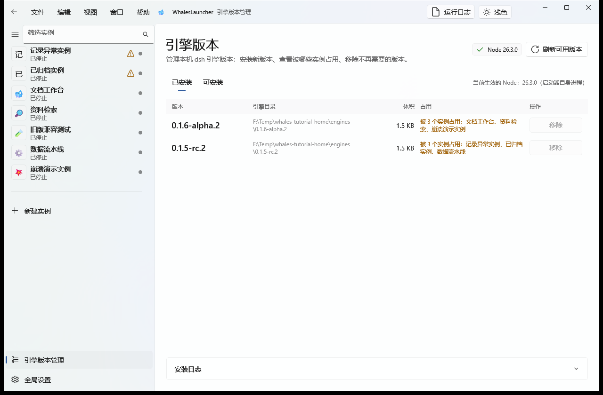
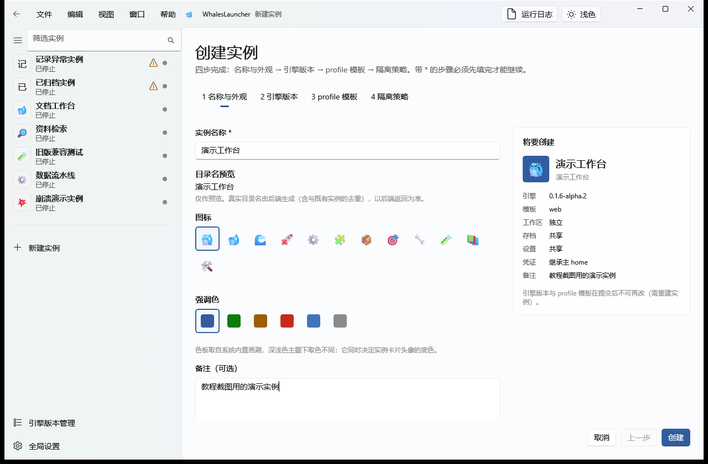
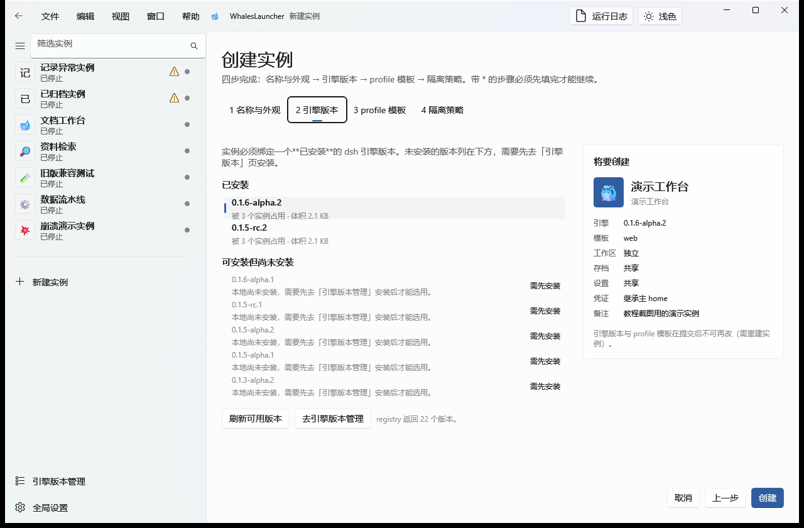
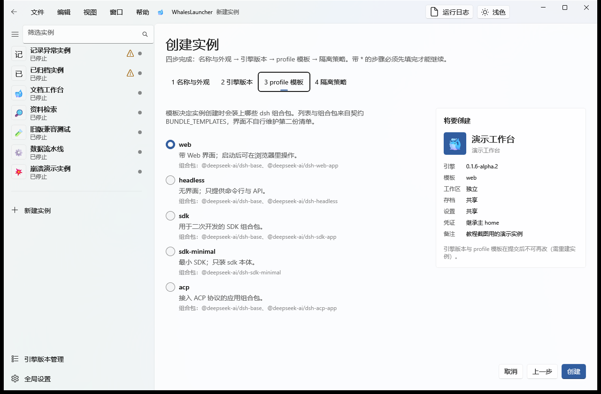
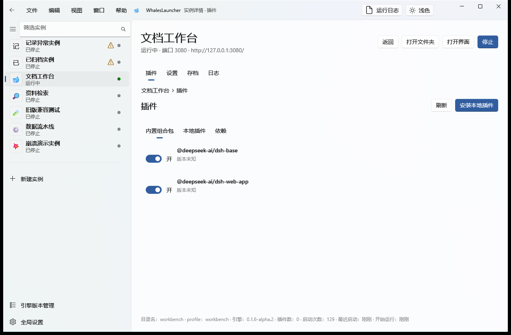
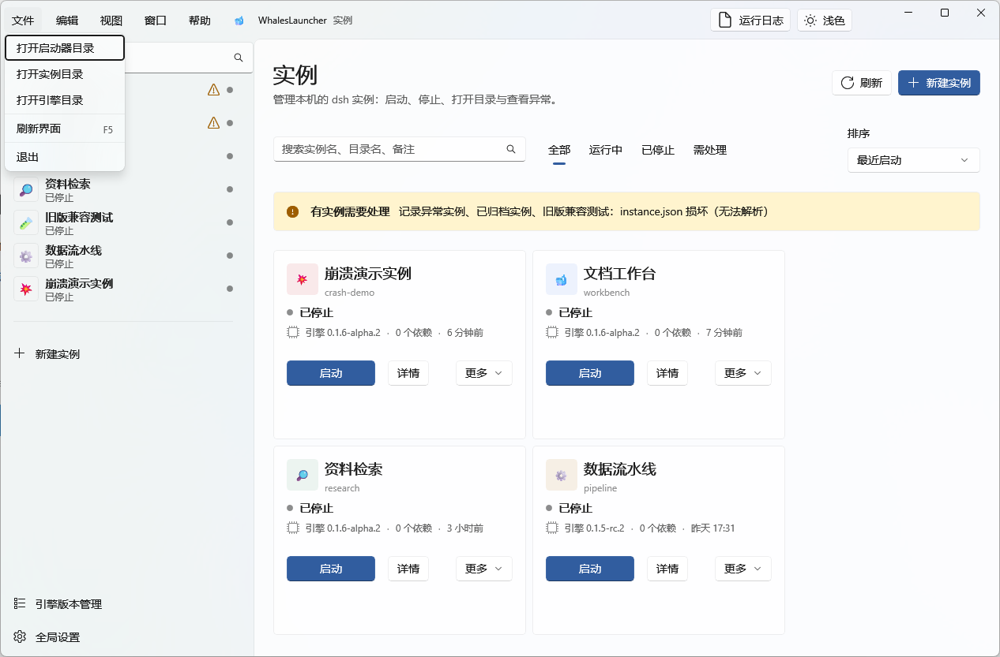

# 02 · 五分钟上手

> 目标：从零到**一个正在运行的实例**。四步，每步都配图。

```
① 装引擎版本  →  ② 新建实例（向导四步）  →  ③ 启动  →  ④ 打开界面
```

---

## ① 装一个 dsh 引擎版本

左侧实例栏**底部**点 **引擎版本管理**（新 UI 没有 `Ctrl+2` 这类数字快捷键）。



*图 17：引擎版本管理页。页签分成「已安装」与「可安装」两段（来源：npm registry 的 `@deepseek-ai/dsh`），底部是安装日志。*

两段**各自独立加载**：本地列表先出现，不被 npm 查询拖住；npm 列表有自己的加载/失败/超时态。

要装一个新版本：

1. 切到「可安装」页签，找到目标版本（带 `预发布` 标记的是 alpha 版本）；
2. 点该行右侧的 **安装**；
3. 页面底部的 **安装日志** 会**实时追加** npm 的输出 —— 首次安装要下载依赖，请保持网络畅通；
4. 装完后该版本会出现在「已安装」页签里，行内标着**哪些实例正在用它**。

已安装列表还会显示体积（例如 `45.0 MB`）。**显示「未知」而不是 `0 B` 是有意的**：
引擎目录若经 junction 接入，统计不跟随链接，显示 `0 B` 会误导。

> **可以同时装多个版本。** 每个实例绑定单一版本，互不影响 —— 想试新版就再装一个，
> 旧实例继续跑旧版。

> ⚠️ **版本兼容提示**（页面顶部黄条）：dsh 不同大版本之间的 profile 格式不保证兼容。
> 把实例切换到更旧的版本前，请确认 profile 结构未被新版本改写。

---

## ② 新建实例（向导四步）

回到 **实例列表**，点页头右上角 **新建实例**。向导一共四步（步骤条可以直接点已解锁的步骤）：

### 第 1 步：名称与外观



*图 7：向导第 1 步。左边填名称/图标/强调色/备注，右边的「将要创建」面板实时显示**实例预览**与**配置摘要**。*

- **实例名称**（必填）：会作为 dsh profile 名校验 —— 不能包含 `/` `\` 等字符，
  也不能使用 `desktop`、`node_modules` 等保留名；
- **目录名由启动器自动派生并去重**，你不用操心重名；
- **图标 / 强调色**：强调色用于实例卡片的色条与头像背景；
- **备注**：写清「这个实例用来做什么」，实例多了以后非常有用。

右侧的「将要创建」面板会随输入实时更新，填错了当场就能看出来。

### 第 2 步：选择引擎版本



*图 8：向导第 2 步。上方是**已安装**的版本（含被几个实例占用、占用体积），下方是**可安装但尚未安装**的版本。*

- **已安装**的版本可以直接点选，选中后即可创建；
- **未安装**的版本也能看到，但行尾标着 **需先安装** —— 需要先去「引擎版本管理」装上才能选；
- 一个实例只能绑定一个版本。**不同实例可以用不同版本。**
- 页面底部还有 **刷新可用版本** 与 **去引擎版本管理** 两个快捷入口。

### 第 3 步：选择 profile 模板



*图 9：向导第 3 步。模板决定实例随附哪些组合包，创建后仍可继续装卸插件。*

| 模板 | 适合什么 |
|---|---|
| **Web 界面**（`web`） | 带本地 Web 界面，适合日常交互；**启动后自动探测界面地址** |
| **无界面批处理**（`headless`） | 一次性执行任务并输出最终结果，适合定时任务与脚本 |
| **SDK 服务**（`sdk`） | JSON-RPC stdio 服务，供其它程序嵌入调用 |
| **最小 SDK**（`sdk-minimal`） | 仅含最小运行时的 SDK 模式，启动最快、占用最低 |
| **ACP 服务**（`acp`） | ACP stdio 协议服务，对接编辑器与 IDE 插件 |

同一页只有**模板**一个选择项 —— 新 UI 不再单独填 profile 名称，profile 名由后端按实例目录名生成
（对应 `$DSH_HOME/profiles/<目录名>`）。

### 第 4 步：隔离策略


*图 10：向导第 4 步。四个维度各自选「独立 / 共享」，没有快速预设按钮。*

四个维度分别是**工作区**、**会话存档**、**设置文件**、**凭证**。新 UI 的默认组合是：

| 维度 | 默认值 |
|---|---|
| 工作区 | **独立**（文件落在实例目录内） |
| 会话存档 | **共享**（多个实例读写同一份 sessions 存档） |
| 设置文件 | **共享**（`settings.yaml` 指向共享文件） |
| 凭证 | **继承主 home** |

第一次用想彻底隔离（四项全独立），就把「存档」和「设置」两项手动改成 **独立**。
反过来，想让多个实例看到彼此的会话记录、或一套配置统管所有实例，保持共享即可。

共享通过 **Windows junction** 实现 —— **不需要管理员权限**，也不需要开发者模式。

> 想深入了解共享的机制、风险与冲突处理，见 [06 隔离与共享](06-isolation-sharing.md)。
> 现在按默认值走就行。

填完点右下角的 **创建**，向导会显示创建进度，完成后可以直接跳到新实例。

---

## ③ 启动实例

回到 **实例列表**，找到刚建的实例，点卡片上的 **启动**。



*图 15：运行中的实例详情页。注意标题下方的绿色状态行「**运行中 · 端口 3080 · http://127.0.0.1:3080/**」、
右上角的 **停止** 按钮，以及页脚的启动次数与「开始运行」时间。*

启动过程中：

- 卡片状态点变绿，状态文字变成 **运行中**，后面直接跟端口 `:3080`；
- 运行中的 Web 实例会多出一个 **打开界面** 按钮（详情页同样在右上角）；
- 所有输出实时进入**运行日志抽屉**（标题栏右上角的「运行日志」按钮，或 `Ctrl+L`）。

### 关于端口：不用你操心

dsh 不传 `--port` 时硬编码落在 **3080**，所以同时启动多个 Web 实例会全抢同一个端口。
启动器的**自动端口避让**消除了这一点：

- 每个实例有**期望端口**（手写的 `--port` 或上次分配到的端口），被占用时在 **3080–3179** 内自动避让；
- 并发启动时靠进程内同步预留 + 操作系统绑定探测，**保证不会选中同一端口**；
- 整个区间占满时回落 `--port 0`，由内核分配 —— 端口耗尽也不会变成启动失败；
- 实际端口记录在**实例日志**、**界面（卡片状态后的 `:端口` / 详情页标题下的「端口 N」）**与**台账** `<root>/cache/ports.json` 三处；
- 非 Web 模板（headless / sdk / acp）**一个参数都不加**。

设计细节见 [自动端口分配设计说明](../design/port-allocation.md)。

---

## ④ 打开界面

Web 模板的实例启动后，点卡片上的 **打开界面**（或详情页右上角的同名按钮），
浏览器会打开自动探测到的地址，形如 `http://127.0.0.1:3080`。

到这一步，**你已经跑通了完整链路**。接下来：

- 想让这个实例具备更多能力 → [04 引擎与插件](04-engines-plugins.md)
- 想改实例的设置或看会话记录 → [05 设置·存档·日志](05-settings-saves-logs.md)
- 想再建几个实例并共享存档 → [03 实例管理](03-instances.md) → [06 隔离与共享](06-isolation-sharing.md)

---

## 快速对照：界面总览


*图 1：实例列表页。顶部是页头（标题 +「刷新」「新建实例」）与工具条（搜索 / 状态筛选 / 排序），
下面是实例卡片网格；左侧是常驻的实例栏（顶部可筛选实例，底部是「引擎版本管理」与「全局设置」），
主题切换在标题栏右上角的「主题」按钮。*



*图 4：标题栏的**应用内菜单**（取代系统菜单栏）。菜单项的快捷键文本来自后端菜单定义的同一份数据，
所以显示与真实绑定不会漂移。*

界面遵循 **Windows 11 原生 Fluent Design**：无边框窗口 + 系统原生窗口控制按钮（保留 Snap Layouts）、
Mica 背景材质（不可用时自动降级）。深浅主题在「全局设置 → 外观」或标题栏「主题」按钮里切换
（当前版本的 `theme` 只有「深色 / 浅色」两个取值，不跟随系统设置）。
设计规范见 [UI 设计方案](../design/ui-redesign.md)。

---

**下一步** → [03 实例管理](03-instances.md)
