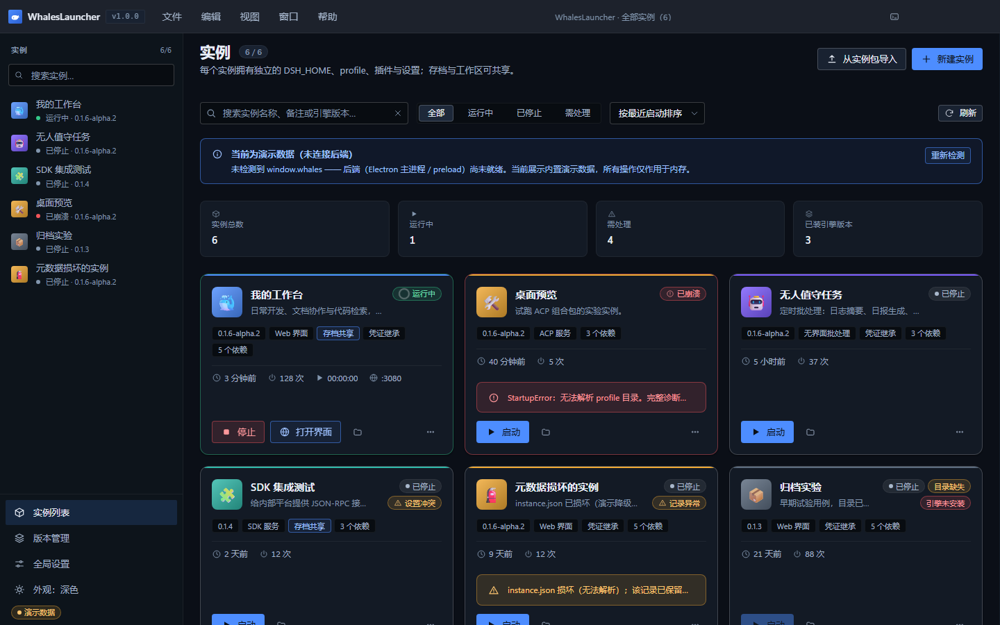
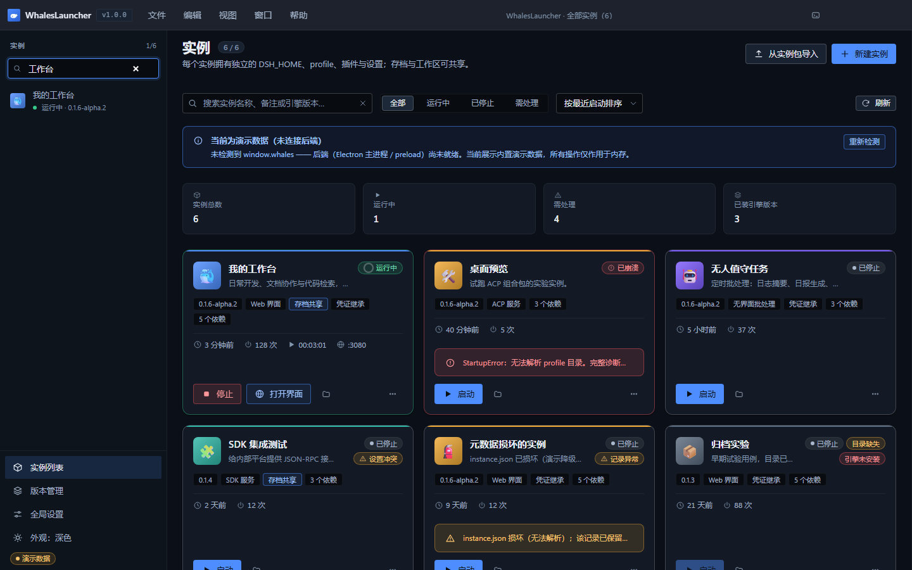
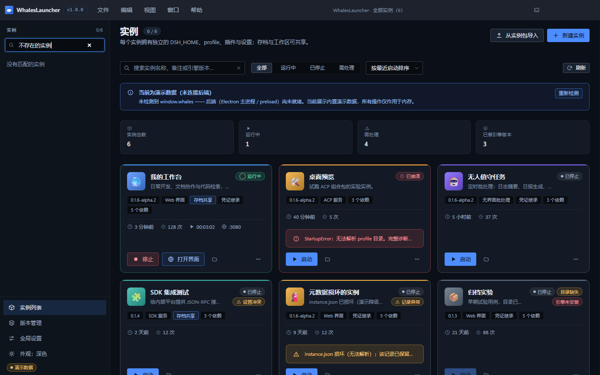
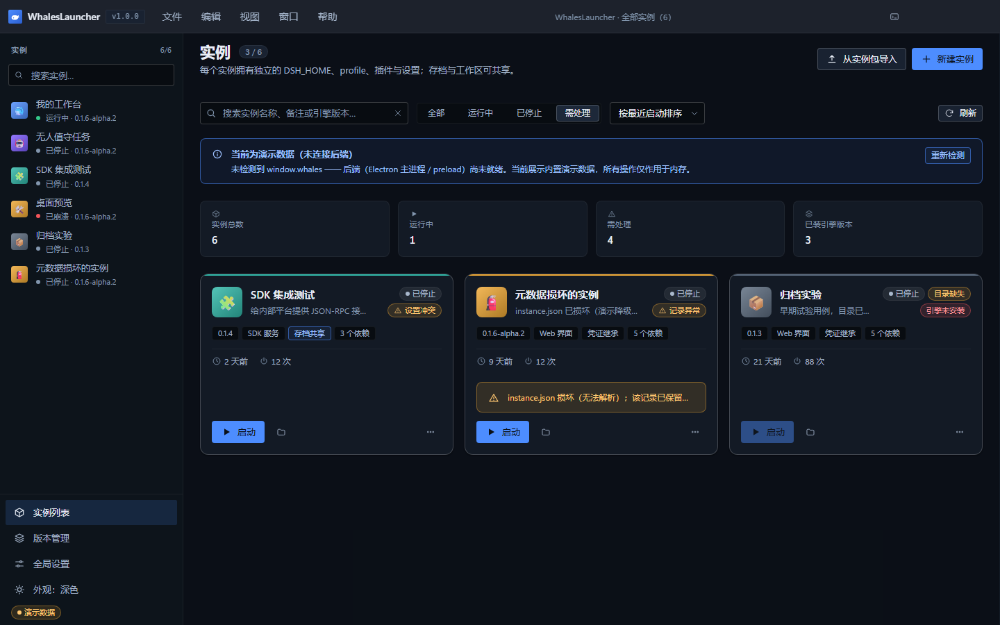
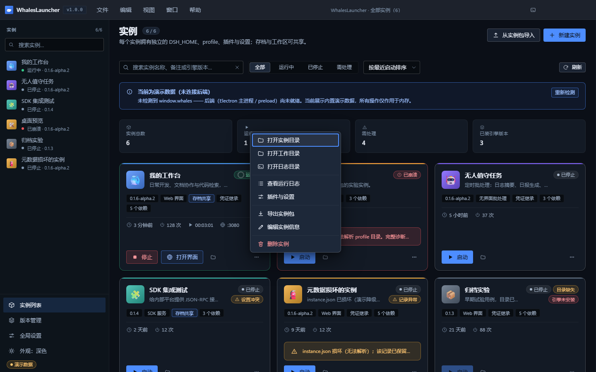
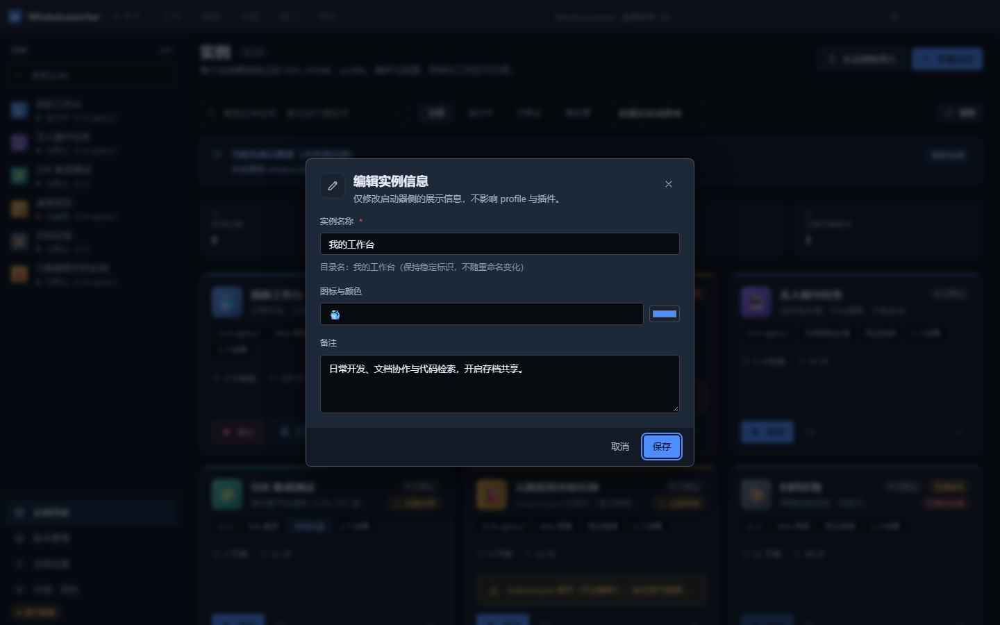
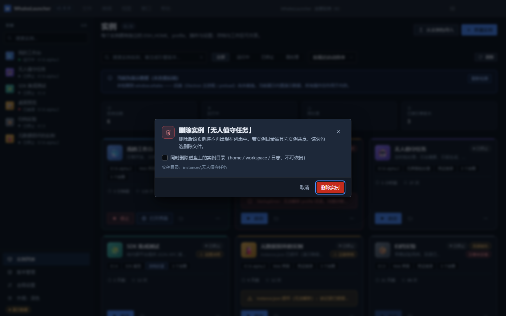
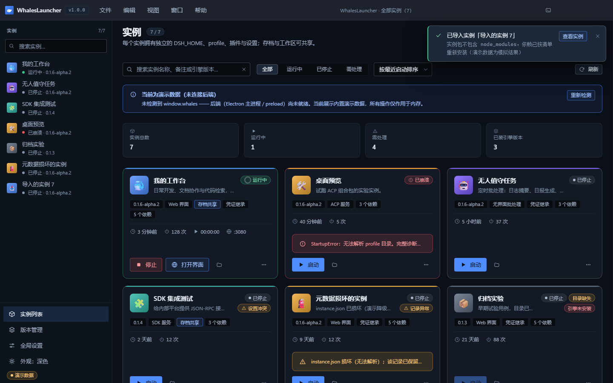

# 03 · 实例管理

> 目标：把「一堆实例」管得清楚 —— 找得到、看得懂状态、改得动、删得干净、搬得走。

---

## 1. 列表页：一眼看清所有实例



*图 1：实例列表页。（演示数据刻意覆盖了 6 种状态。）*

从上到下四层：

| 层 | 内容 |
|---|---|
| **概览统计** | 实例总数 / 运行中 / 需处理 / 已装引擎版本 —— 四个数字点一下就跳到对应筛选 |
| **工具条** | 搜索框、状态筛选（全部 / 运行中 / 已停止 / **需处理**）、排序方式、刷新 |
| **卡片网格** | 每个实例一张卡：状态、引擎版本、模板、共享标记、统计项、操作按钮 |
| **左侧实例栏** | 常驻的实例列表，点一下直接进详情；底部可切深浅主题 |

### 搜索



*图 3：搜索框支持**实例名称、备注、引擎版本**三个字段。*

输入即过滤，右侧 `×` 清空。搜不到时的空态：



*图 22：没有匹配的实例时给出「清空筛选」按钮，而不是一片空白。*

### 筛选「需处理」



*图 2：点概览统计里的「需处理」或工具条上的同名筛选项，只看需要你介入的实例。*

**「需处理」是一个统一判定，不是一堆零散规则的拼凑** —— 筛选器与概览统计卡共用同一份判定，
所以不会出现「筛选里有、统计里没有」的错位。以下情况都计入：

| 徽标 | 含义 |
|---|---|
| `目录缺失` | 实例目录不存在，可能已被移动或删除 |
| `引擎未安装` | 本地没有该实例绑定的引擎版本 |
| `记录异常` | `instance.json` 损坏 / 元数据被删 / 清单损坏 |
| `设置冲突` | 本地设置与共享设置不一致，尚未应用（详见 [06](06-isolation-sharing.md#共享设置冲突怎么处理)） |
| `已崩溃` | 上次启动异常退出（卡片上会有错误原因横幅） |

### 排序

四种方式：**按最近启动 / 按名称 / 按创建时间 / 按启动次数**。

---

## 2. 读懂一张实例卡片

一张卡片上的信息都是「你接下来会想知道的」：

```
┌─ 强调色条 ─────────────────────────────────┐
│ 🐳  我的工作台                    ● 运行中  │  ← 图标 + 名称 + 状态徽标
│     日常开发、文档协作与代码检索…           │  ← 备注
│                                            │
│ [0.1.6-alpha.2] [Web 界面] [存档共享] [凭证继承] │  ← 引擎版本 / 模板 / 共享标记
│ [5 个依赖]                                 │
│                                            │
│ 🕐 3 分钟前   ↻ 128 次   ▶ 00:03:02   ⊕ 3080 │  ← 上次启动 / 次数 / 运行计时 / 端口
│                                            │
│ [■ 停止] [🌐 打开界面] [📁]            [⋯]  │  ← 主操作 + 更多
└────────────────────────────────────────────┘
```

- **状态点**：运动态是 16px **确定性进度环**，静止态是 6px 圆点，崩溃是 `alertCircle` ——
  颜色、文字、形状**三个通道**同时表达状态，不只靠颜色；
- **端口**（`⊕ 3080`）：只对 Web 模板显示，悬停可看说明。端口由启动器自动避让分配；
- **异常时**卡片上会直接出现原因横幅，不用点进去猜。

---

## 3. 卡片「更多操作」



*图 5：卡片右下角 `⋯` 打开的菜单。*

| 菜单项 | 作用 |
|---|---|
| 打开实例目录 | 打开 `instances/<实例名>/` |
| 打开工作目录 | 打开该实例的 `workspace/`（共享模式下会打开共享区的真实目录） |
| 打开日志目录 | 打开该实例的 `logs/` |
| 查看运行日志 | 在**右侧抽屉**中看实时输出 |
| 插件与设置 | 直接进入详情页的「插件」页签 |
| 导出实例包 | 导出为 zip（见下文第 6 节） |
| 编辑实例信息 | 改名、换图标/颜色、改备注 |
| 删除实例 | 二次确认后删除（**红色**，运行中时禁用） |

> 运行中的实例「删除实例」是**禁用**的 —— 先停止再删。

---

## 4. 编辑实例信息



*图 19：编辑实例信息模态。*

可以改**实例名称、图标、颜色、备注**。两个要点：

- 这里只改**启动器侧的展示信息**，不影响 profile 与插件；
- **目录名保持稳定，不随重命名变化** —— 重命名不会搬动磁盘上的目录，
  所以共享链接、外部脚本里的路径都不会因为改名而失效。

---

## 5. 删除实例



*图 20：删除确认。默认**不勾选**「同时删除磁盘上的实例目录」，也就是说默认只移出列表、文件保留。*

删除的语义分两种，务必看清勾选框：

| 选择 | 结果 |
|---|---|
| **不勾选**（默认） | 仅把实例移出列表，磁盘上的 `home / workspace / 日志` **原样保留** |
| **勾选** | 连同磁盘上的实例目录一起删除，**不可恢复** |

> **共享目录不受影响。** 若该实例的工作区/存档链接到了 `shared/`，删除实例**不会**清理共享区
> —— 这是 core 的有意设计（避免误删别的实例正在用的数据），只报告孤儿目录，需要你手工处理。
> 详见 [06 隔离与共享](06-isolation-sharing.md#删除实例时共享区会怎样)。

「全局设置 → 行为 → 删除实例前二次确认」可以控制确认框的详尽程度（关掉它仍会弹确认框，但流程简化且默认保留文件）。

---

## 6. 实例包：导出与导入

实例包（zip）是把一个实例**搬到另一台机器**的载体。

### 导出

卡片 `⋯` → **导出实例包** → 选择保存位置。导出完成后会弹提示，并可**一键复制路径**。

包内结构（**不含 `node_modules`**）：

```
whalelauncher-pack.json              包元数据 + 实例元数据 + 依赖清单
home/profiles/<profile>/package.json profile 清单（组合包列表 + 依赖）
home/profiles/<profile>/cordis.patch.yml  用户 patch 层
home/settings.yaml                   实例设置（有内容才带）
README.md                            包说明
```

**为什么不打包 `node_modules`**：与 PCL2 整合包同样的取舍 —— 依赖按清单在导入端重装，
包体小得多，也不会把平台相关二进制带错。

### 导入



*图 21：列表页右上角「从实例包导入」。*

导入时会：

1. 校验包元数据与版本；解压**手工逐条写入并校验路径**（拒绝绝对路径与 `..`），避免 zip-slip 把文件写到目标目录之外；
2. 按 manifest 重装依赖；
3. 完成后弹出提示，可直接 **查看实例**；有告警时（例如引擎版本未安装）会一并列出。

> 导入后若提示「引擎未安装」，去 [版本管理](04-engines-plugins.md) 装上对应版本即可启动。

---

## 7. 目录：实例到底存在哪

```
instances/<实例名>/
├── instance.json       # 启动器元数据（唯一事实源）
├── home/               # ← 该实例专属的 DSH_HOME
│   ├── profiles/<profile>/    # package.json（插件与组合包）+ cordis.patch.yml
│   ├── settings.yaml          # 该实例独享的设置
│   ├── .credentials.yaml      # 凭证（可继承主 home）
│   └── sessions/              # 该实例的会话
├── workspace/          # 默认工作文件夹（可为 junction）
└── logs/               # 启动日志
```

启动实例时，启动器以 `DSH_HOME=<实例>/home`、`cwd=<实例工作区>` 派生 dsh 进程 ——
所以删掉整个实例目录就等于彻底删除，不会留残留、也不影响别的实例。

---

**下一步** → [04 引擎版本与插件](04-engines-plugins.md)
