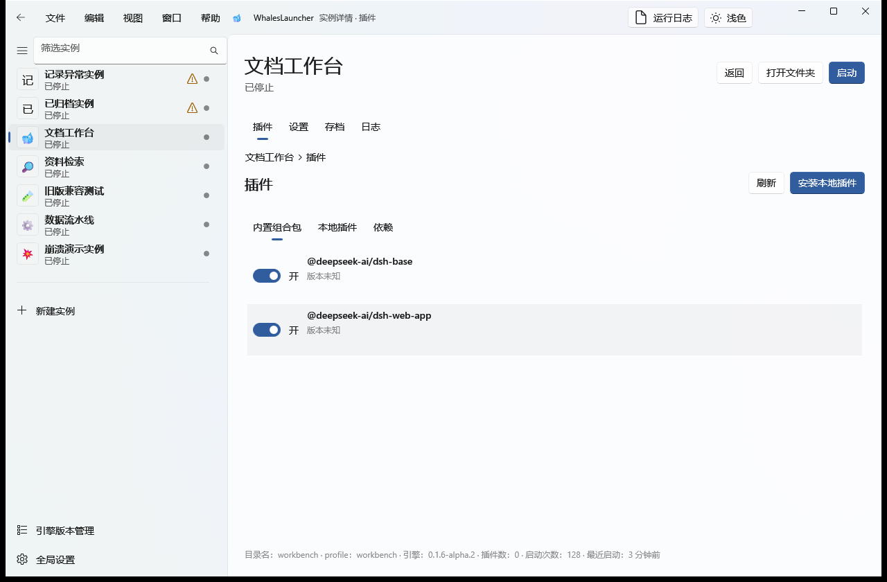

# 04 · 引擎版本与插件

> 目标：让每个实例用上**它需要的那一版 dsh** 和**它需要的那几个能力**，且互不牵连。

---

## 1. 引擎版本管理

左侧实例栏底部的 **引擎版本管理**（新 UI 没有 `Ctrl+2` 这类数字快捷键）。


*图 17：引擎版本管理页。页头右侧是当前生效的 Node 版本与「刷新可用版本」，页面顶部还有「已安装 / 可安装」两个页签。*

### 引擎是什么

引擎就是 dsh 本体，装在：

```
engines/<版本>/node_modules/@deepseek-ai/dsh
```

来自 npm 的 `@deepseek-ai/dsh`。**每个实例绑定一个版本，多个版本可以共存** ——
这样升级新版本试水时，旧实例继续跑旧版，不会被拖下水。

### 页面两段

| 页签 | 说明 |
|---|---|
| **已安装** | 表格四列：**版本 / 引擎目录 / 体积 / 占用**（写着「被 N 个实例占用」并列出实例名），行尾是 **移除** |
| **可安装** | 从 npm registry 查询到的版本列表（预发布版本同样列出），行尾是 **需先安装** 与安装入口 |

两段**各自独立加载**：本地列表先渲染，npm 查询再慢也不会拖住它；查询失败时该段单独给出错误与重试入口。
页面底部还有一个 **安装日志** 折叠区，npm 的输出实时追加在这里。

### 安装一个版本

1. 切到 **可安装** 页签，找到目标版本 → 点安装；
2. 页面底部 **安装日志** 折叠区**实时追加** npm 输出；
3. 完成后该版本出现在 **已安装** 页签里。

安装过程由 npm 在本机执行，**需要网络**；首次安装要下载依赖，请保持网络畅通。

### 卸载与占用保护

「已安装」表格的 **占用** 列会标出**哪些实例在用它**。**被实例占用时不能直接卸载** ——
页面会给出「被实例占用」的明确状态，而不是让你删掉之后实例莫名其妙起不来。
要卸载就先让那些实例改用别的版本（在实例详情的「实例信息」里换绑）或删除它们。

### 两个容易误解的地方

**① 体积显示「未知」不等于空目录。**
core 的目录体积统计**不跟随 junction**，而引擎可以被 junction 接入，所以 `0` 不代表空。
界面在这种情况下显示「未知」（或尚未算完时留空），避免用户以为引擎是坏的。

**② 版本兼容提示。**
dsh 不同大版本之间的 profile 格式不保证兼容 —— 把实例切换到更旧的版本前，请确认 profile
结构未被新版本改写（这一点在实例详情的设置页与版本管理页都有说明）。

---

## 2. 插件与组合包

进入某个实例的详情页 → **插件** 页签（点卡片上的 **详情** 按钮就落在这个页签，左栏点实例名也一样）。



*图 11：详情页「插件」页签。页头是实例名与状态，下面是「插件 / 设置 / 存档 / 日志」四个页签。*

### 先分清三个概念

| 概念 | 是什么 | 落在哪 |
|---|---|---|
| **组合包**（bundle） | 按 `dsh.profile.bundles` 的顺序**叠加 patch**，决定实例具备哪些能力 | `cordis.patch.yml` 的 bundles 顺序 |
| **插件依赖** | 普通 npm 依赖，安装在该实例 profile 的 `node_modules` 中 | `home/profiles/<profile>/package.json` |
| **本地插件** | 插件文件放进实例目录 `home/plugins`，profile 只记相对路径 | 随实例目录走 |

页面上对应的三块以三个子页签呈现：**内置组合包**、**本地插件**、**依赖**。

### 组合包开关


在「内置组合包」子页签里，每个组合包一行，左侧一个开关（打开/关闭后立即写 profile）：

- **内置组合包**（如 `@deepseek-ai/dsh-base`、`@deepseek-ai/dsh-web-app`）随 dsh 提供
  —— **可停用但不可卸载**；
- **第三方组合包**可以停用也可以移除；
- 开关写的是 `dsh.profile.bundles`，也就是**能力层**。

> 停用一个组合包等于卸掉这个实例的一层能力。拿不准就别动 `dsh-base`。

### 安装新插件

插件区右上角有 **刷新** 与 **安装本地插件** 两个按钮：

- **安装本地插件**：弹出安装面板，按来源分三种（GitHub 链接 / 压缩包 / 文件夹），
  安装进度与原始输出都在面板里；「依赖」子页签管理的是走 npm 的插件依赖。
- **刷新**：重新读取清单（外部改动过 `package.json` 时用得上）。

- **安装失败会回滚 `package.json` 与锁文件**，不会留下半截状态；
- 走的是 `dsh plugin` CLI，与 dsh 自己的写锁一致；
- 进度也可以看**运行日志抽屉**（标题栏「运行日志」按钮或 `Ctrl+L`）。

每个已装插件后面有 **卸载 / 删除插件…** 按钮（带二次确认）。

### 本地插件：跟着实例走

本地插件是这套设计里比较特别的一块：

> 插件文件放进实例目录 `home\plugins`，profile 只记**相对路径** ——
> 整个实例目录复制到别处（或打进实例包）时，插件不会丢。
> 亦可直接从 **GitHub 仓库** 或 **zip 压缩包** 安装。

安装方式三选一（安装面板里的选择器）：

| 方式 | 说明 |
|---|---|
| **GitHub 链接** | 走 profile 依赖；迁移后按 profile 清单重新安装 |
| **压缩包** | 文件本体落在 `home\plugins` 下，**复制实例目录即可带走** |
| **文件夹** | junction 指向实例之外的源目录，**不随实例搬运**，换机器需重新安装 |

页面上会用徽标标出每个本地插件的来源与可搬运性：

| 徽标 | 含义 |
|---|---|
| `压缩包 · 随实例搬运` | 文件在 `home\plugins` 下，复制实例目录即可带走 |
| `文件夹链接 · 不随实例搬运` | junction 指向实例之外的源目录，换机器需重新安装 |
| `GitHub · 走 profile 依赖` | 迁移后按 profile 清单重新安装 |
| `手工放入` | 目录里没有来源标记，迁移后需自行确认 |
| `来源未知` | 来源标记损坏 |

### 插件状态徽标

| 徽标 | 含义 |
|---|---|
| `已安装` | 依赖、包文件、`dsh.profile.bundles` 三处均已确认 |
| `已装但未启用` | 依赖已就位，但未登记进 `dsh.profile.bundles` |
| `含客户端界面` | 提供 Web GUI 界面，**刷新 Web GUI 后才能看到它提供的界面** |
| `无 dsh.bundle.patch` | 作为普通依赖安装，不进入组合包层；纯客户端插件由 dsh 处理 |
| `patch 文件缺失` | 声明的 `dsh.bundle.patch` 在包内不存在，**实例启动会失败** |

### 两条操作纪律

1. **实例运行中变更插件前先停实例。** 页面会提示：

   > dsh 的插件操作会对 profile 加写锁，建议先停止实例再变更插件，避免安装被中断。

2. **插件页只是这台实例的事。** 普通依赖装在**该实例** profile 的 `node_modules` 中，
   不会影响其它实例 —— 这正是「实例隔离」的直接体现。

---

## 3. 插件页上的其它入口

- **打开文件夹 ▸ 插件 plugins**（卡片 `⋯` 菜单）—— 本地插件的家（`home\plugins`）；
- **打开文件夹 ▸ 根目录 / 主目录 home** —— 插件与配置树都落在实例目录里，可以直接查看生成的配置文件；
- 详情页设置页签的 **打开目录** —— 打开 `settings.yaml` 所在目录；
- **刷新** —— 重新读取清单（外部改动过 `package.json` 时用得上）。

> 旧版的「打开 profile 目录 / 打开插件目录」两个专用按钮已合并进卡片 `⋯` →
> **打开文件夹** 子菜单（根目录 / 主目录 home / 工作区 workspace / 日志 logs / 插件 plugins）。

---

**下一步** → [05 设置·存档·日志](05-settings-saves-logs.md)
