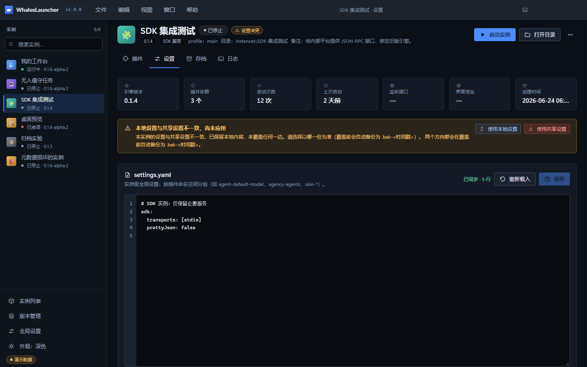
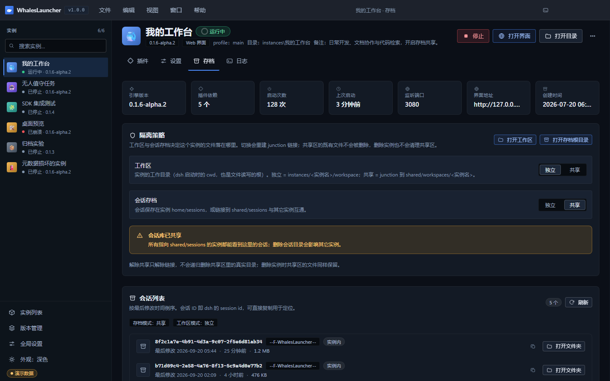
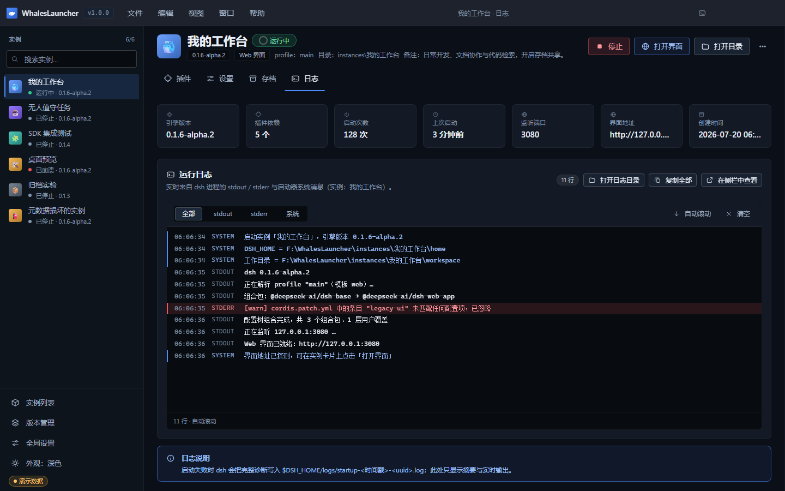
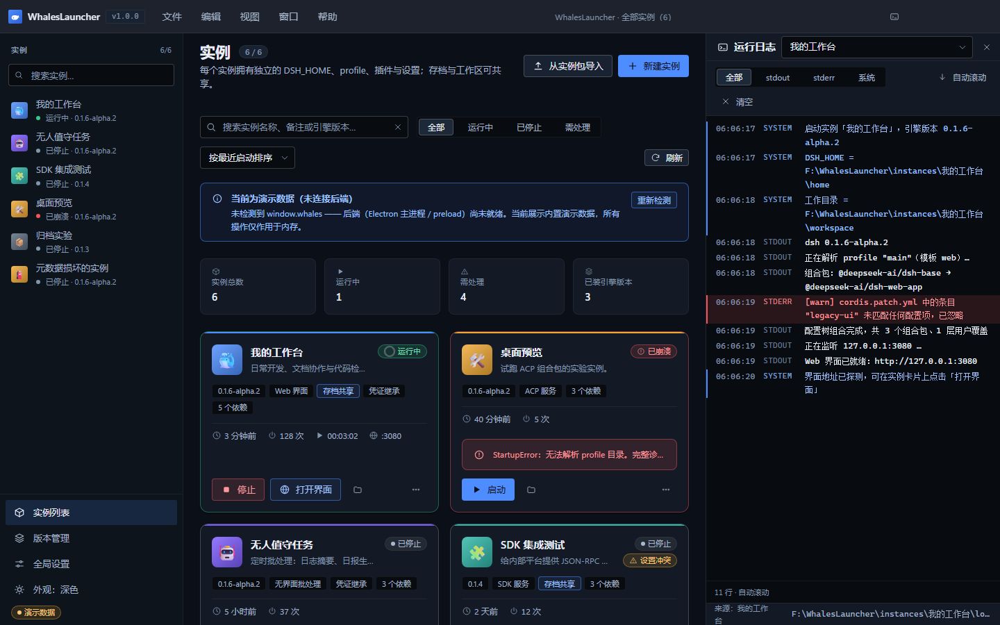

# 05 · 设置 · 存档 · 日志

> 目标：会改实例的设置、找得到自己的会话记录、看得到实例到底在干什么。

实例详情页有四个页签：**插件 / 设置 / 存档 / 日志**。
插件页见 [04](04-engines-plugins.md#2-插件与组合包)，这一章讲另外三个。

---

## 1. 设置页签：编辑 settings.yaml



*图 12：设置页签。上半部分是页头与统计卡，中间是设置冲突提示，下面是 `settings.yaml` 编辑器。*

### 编辑器怎么用

| 操作 | 说明 |
|---|---|
| 直接编辑 | 带**行号**，Tab 键插入两个空格 |
| **`Ctrl+S`** | 保存 |
| **重新载入** | 丢弃未保存的修改，从磁盘重新读取 |
| 保存前校验 | 空内容会被拒绝保存，不会让你把配置清空 |

保存是**安全**的：先备份为 `settings.yaml.bak-<时间戳>`，再**原子写入**（同目录临时文件 + rename）。
所以你永远不会遇到「写到一半断电、配置文件半截」的情况。

右上角的状态提示会显示「已同步 · N 行」，让你知道编辑器内容和磁盘是否一致。

### 这个文件管什么

`settings.yaml` 是**实例级全局设置**，按插件命名空间分组，例如：

```yaml
# SDK 实例：仅保留必要服务
sdk:
  transports: [stdio]
  prettyJson: false
```

> **运行中改设置不会立即生效。** `settings.yaml` 在实例**启动时**读取 ——
> 运行中保存不报错，但要**重启实例**才应用。页面会明确提示这一点。

> **共享设置时的影响面。** 若该实例的设置文件处于「共享」模式，这里的修改会
> **影响所有共享实例**。页面上有对应提示条。

### 设置冲突：本地 vs 共享

如果你看到这条黄条，说明**本地设置与共享设置不一致、且尚未应用**：

> 本地设置与共享设置不一致，尚未应用
> 本实例的设置与共享设置不一致。已保留本地内容、未覆盖任何一边。请选择以哪一份为准
> （覆盖前会自动备份为 `.bak-<时间戳>`）。两个方向都会在覆盖前自动备份。

两个按钮对应两个方向：

| 按钮 | 效果 |
|---|---|
| **使用本地设置** | 以本地为准，覆盖共享侧 |
| **使用共享设置** | 以共享为准，覆盖本地侧 |

**两个方向都会覆盖前自动备份**。这个状态同时会以 `设置冲突` 徽标出现在实例卡片上，
并计入「需处理」筛选 —— 不会悄悄积压。详见 [06 隔离与共享](06-isolation-sharing.md#共享设置冲突怎么处理)。

### 启动参数（appArgs）

设置页下方还有「启动参数」区块，用来给 dsh **应用层**追加参数（位于 `--profile <名字>` 之后）：

| 参数 | 作用 |
|---|---|
| `--port 3081` | 换监听端口（启动失败提示 `EADDRINUSE` 时在这里改） |
| `--no-open` | 不自动打开浏览器 |

- 按**空白**拆分为多个参数；含空格的参数暂不支持；
- 修改后**需重启实例**才生效；
- 这是给「非 Web 模板」或特殊场景留的手动口子 —— Web 实例的端口本来就会**自动避让**，
  通常不需要你指定。

---

## 2. 存档页签：会话与工作区



*图 13：存档页签。上半部分是「隔离策略」（工作区 / 会话存档），下半部分是「会话列表」。*

### 会话列表

| 列 | 说明 |
|---|---|
| 会话 ID | 即 dsh 的 session id，**可直接复制**用于定位问题 |
| 最后修改 | 按最后修改时间**倒序**排列 |
| 体积 | 该会话占用的空间 |
| 标记 | 例如 `实例内` / `共享库` |

每条会话右侧有 **打开文件夹**，直接跳到它在磁盘上的位置。

顶部还有一排辅助信息：**存档模式**（共享 / 独立）、**工作区模式**（共享 / 独立），
以及「打开工作区」「打开存档根目录」两个快捷按钮。

### 隔离策略

存档页的「隔离策略」卡片可以切换**工作区**与**会话存档**的独立/共享：

- 描述文案会**实时说明当前模式的落盘位置**：
  独立 = `instances/<实例名>/workspace`；共享 = junction 到 `shared/workspaces/<实例名>`；
- 切换是**危险方向**操作，带二次确认；
- 确认框会写明「**解除链接不递归删除真实目录**」—— 也就是说，切回独立不会删掉共享区的数据。

> 完整的共享语义、风险与冲突处理见 [06 隔离与共享](06-isolation-sharing.md)。
> 这里只需要知道：**共享后文件落在共享区，多个实例指向同一目录会互相看到、互相覆盖。**

---

## 3. 日志页签



*图 14：日志页签。*

| 按钮 | 作用 |
|---|---|
| **在侧栏中查看** | 打开右下角日志抽屉，跟着实时输出走 |
| **打开日志目录** | 打开 `instances/<实例名>/logs/` |
| **复制全部** | 把当前日志整段复制到剪贴板（贴进 issue 很方便） |

> **重要**：启动失败时，dsh 会把**完整诊断**写入
> `$DSH_HOME/logs/startup-<时间戳>-<uuid>.log`；
> 页面上的日志区**只显示摘要与实时输出**。排查启动失败请优先去日志目录拿那份完整文件。

---

## 4. 运行日志抽屉（全局）

任何时候按标题栏的 `>_` 图标或 **`Ctrl+L`**，右侧滑出日志抽屉：



*图 6：日志抽屉。顶部可选择查看哪个实例的日志，下面是分色输出的实时日志。*

| 特性 | 说明 |
|---|---|
| **分色** | `stdout` / `stderr` / `系统` 三类用不同颜色与标签区分 |
| **筛选** | 顶部按钮按类型过滤（全部 / stdout / stderr / 系统） |
| **自动滚动** | 默认跟随最新输出；**向上滚动会自动暂停**，不会把你正在看的内容顶跑 |
| **清空** | 一键清掉当前缓冲 |
| **启动器级日志** | 按实例过滤时，`launcher` 级别的日志**依然可见**（首次出现会额外弹一次可关闭的提示） |

---

## 5. 启动器自己的日志：三个文件各管什么

以上都是**实例**的日志。启动器自己的日志在项目根目录 `logs/` 下，分工明确：

| 文件 | 写入方式 | 什么时候看 |
|---|---|---|
| **`launcher-summary.log`** | **每次启动覆盖写** | **「双击没反应」第一个该看的文件**。一屏之内给出：时间、入口、构建决策、实际执行的命令、退出码结论、Electron 日志末尾 |
| `launcher-<时间戳>.log` | Electron 日志，**保留最近 5 份** | 需要完整运行日志时 |
| `launcher-console-<时间戳>.log` | 快捷方式路径下的 shell 层兜底输出，**保留 7 天** | 只兜「node 根本没跑起来」这类情况 |

> 固定名日志（快捷方式用的 `launcher-shortcut.log`）会把上一份归档到 `logs/history/`。

---

## 6. 全局设置页

左侧导航 **全局设置**（`Ctrl+3`）—— 注意它**只影响启动器自身**，
实例的 profile、插件与设置都在各实例详情里管。


*图 18：全局设置页。*

| 区块 | 可设置什么 |
|---|---|
| **外观** | 界面主题（深色 / 浅色，立即生效）。也可以点左栏底部的图标快速切换 |
| **行为** | 删除实例前二次确认的**详尽程度**（关掉后仍会弹确认框，但流程简化且默认保留文件） |
| **数据位置** | 启动器根目录、**主 home**、**npm registry**（可改，改完点保存） |
| **Node 运行时** | 探测结果、手动指定 `node.exe`、重新检测 —— 见 [01](01-install.md#2-为什么实例不能借用启动器自带的-node) |
| **关于** | 版本号、运行模式、界面框架、配置文件位置 |
| **概念速查** | 五个核心概念的一句话解释（实例 / 插件 / 存档 / 引擎版本 / 设置） |

**主 home** 那一项值得留意：凭证继承策略下，启动实例前会从「主 home」复制 `.credentials.yaml`，
避免每个实例重复登录。

---

**下一步** → [06 隔离与共享](06-isolation-sharing.md)
