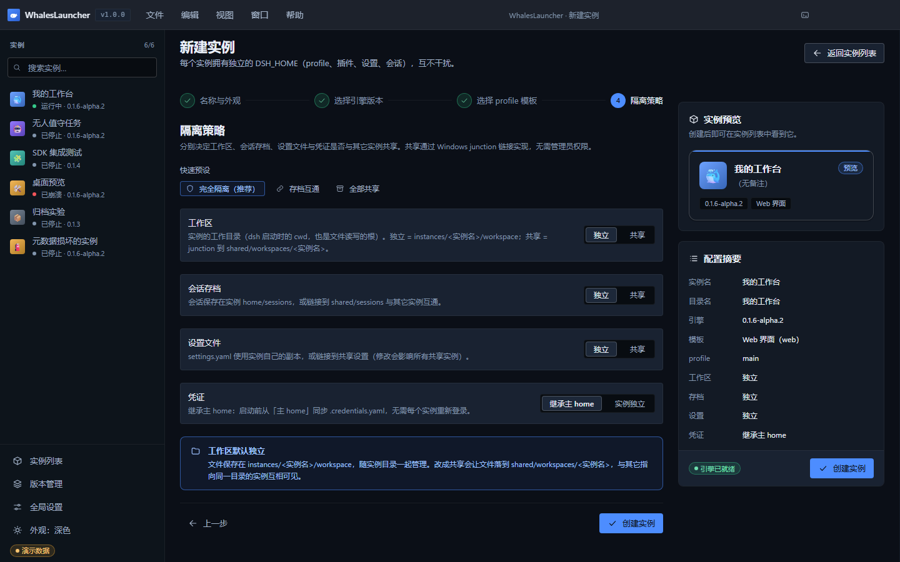

# 06 · 隔离与共享

> 目标：搞清楚「哪些东西是分开的、哪些是可以共用的」，以及**共享之后你承担了什么**。

这是本启动器最需要理解的一章。**四项全独立**永远安全；一旦打开共享，就要知道代价。

---

## 1. 四个维度，各自独立决定

创建实例向导的第 4 步，以及实例详情的 **设置** 页签（「隔离策略」折叠段），都是这四个维度：

| 维度 | 独立（`local`） | 共享（`shared`） |
|---|---|---|
| **工作区** | `instances/<实例名>/workspace` | junction → `shared/workspaces/<实例名>` |
| **会话存档** | 实例 `home/sessions` | junction → `shared/sessions` |
| **设置文件** | 实例自己的 `settings.yaml` 副本 | junction → 共享设置 |
| **凭证** | 使用实例自己的 `.credentials.yaml` | **继承主 home**：启动前从主 home 复制 `.credentials.yaml` |

注意凭证是**唯一的例外**：它没有「共享目录」这种模式，只有「继承主 home」——
因为凭证是**启动前复制**过去的，不改变目录结构，所以也不需要链接。

*图 10：向导第 4 步。四个维度各一行单选，**没有**旧版的三个快速预设。*

### 默认组合与「要不要全隔离」

新 UI 的默认值是 **工作区独立 + 存档共享 + 设置共享 + 凭证继承主 home**。
想要旧版那种「完全隔离」，在向导第 4 步把「存档」和「设置」两项手动改成 **独立** 即可
（四项互不干扰，代价是多个实例之间看不到彼此的会话与配置）：

| 想要的组合 | 怎么选 | 什么时候用 |
|---|---|---|
| **全独立** | 四项都选独立 | 实例之间完全互不干扰，最保守 |
| **只共享存档** | 工作区/设置独立，存档共享 | 想让多个实例看到彼此的会话记录 |
| **都共享**（默认） | 保持默认值 | 一套配置统管所有实例，且希望会话互通 |
| **只共享工作区** | 工作区共享，其余独立 | 多个实例服务同一个项目目录 |

---

## 2. 共享是怎么实现的：junction

共享不是复制文件，而是 **Windows junction 目录链接**。

- **不需要管理员权限**，也不需要开发者模式（这是选 junction 而不是符号链接的直接原因）；
- 对 dsh 来说，这就是一个普通目录，它**完全不知道**自己被链接了 ——
  所以共享不需要 dsh 侧的任何配合；
- 解除共享**只解除链接**，不会递归删除共享区里的真实目录。

---

## 3. 共享工作区：文件实际落在共享区

界面在切到共享时会给出这条提示，请完整读一遍：

> **共享工作区：文件实际落在共享区**
> 共享后实例的工作区是 junction，文件保存在 `shared/workspaces/<实例名>`；
> 多个实例指向同一目录时会**互相看到、互相覆盖**文件。
> 删除实例**不会**清理共享工作区（core 的有意设计：只报告孤儿目录），需要手工删除。

三条关键结论：

1. **文件不在实例目录里了** —— 备份实例目录时别忘了 `shared/`；
2. **多实例指向同一目录 = 共享同一份文件** —— 一个实例写的文件，另一个立刻能看到，
   也可能被覆盖。**不要**把两个会同时写同一批文件的实例指到同一个工作区；
3. **删除实例不会清理共享工作区** —— 见下文第 6 节。

---

## 4. 共享会话库：会话变成公共的

切到共享会话库时：

> ⚠️ **会话库已共享**
> 所有指向 `shared/sessions` 的实例都能看到这里的会话；**删除会话目录会影响其它实例**。

会话列表里来自共享库的条目会带 `共享库` 徽标，一眼能分辨。

---

## 5. 共享设置冲突怎么处理

共享设置最容易出「状况」。界面把这件事做成了**显式状态**，而不是悄悄覆盖：

| 状态 | 现象 | 处理 |
|---|---|---|
| **一致** | 无提示 | 正常 |
| **不一致、尚未应用** | 设置页出现黄条；实例卡片出现 `设置冲突` 徽标；计入「需处理」筛选 | 选一个方向解决（见下） |
| **已解决** | 提示条与徽标**同步消失** | — |

黄条上的两个按钮对应两个方向，**两个方向都会在覆盖前自动备份为 `.bak-<时间戳>`**：

| 按钮 | 效果 |
|---|---|
| **使用本地设置** | 以本地为准，覆盖共享侧 |
| **使用共享设置** | 以共享为准，覆盖本地侧 |

用**红色实心按钮**标出危险方向，并要求二次确认 —— 覆盖是破坏性的，界面不打算让你误点。

> 这个冲突**永远不会被自动「修复」**：core 保留本地内容、也不覆盖共享，等你来裁决。
> 这正是「绝不静默删数据」原则的体现。

---

## 6. 删除实例时，共享区会怎样

这是最容易被误解的一点，单独说清：

| 你删除了实例 | 结果 |
|---|---|
| 实例自己的 `home/`、`logs/` | **保留在磁盘上**（新 UI 的删除只移出列表，磁盘目录总是保留） |
| 链接到 `shared/workspaces/<实例名>` 的工作区 | **保留**。链接被解除，共享区的目录还在 |
| 链接到 `shared/sessions` 的会话 | **保留**。那是所有共享实例共用的 |
| 共享设置 | **保留** |

也就是说，**共享区里的数据不会被实例的生死牵连** —— 这是刻意的设计：
共享区可能还有别的实例在用，启动器**不会替你决定**哪些是垃圾。
代价是共享区可能留下**孤儿目录**（没有任何实例再指向它），需要你手工清理。

---

## 7. 切换隔离模式的操作要点

工作区 / 会话存档 / 设置文件的切换都是**危险方向操作**：

- 危险按钮用系统危险色（红色实心）样式；
- 弹**二次确认**，确认框里写明要改的维度、从哪个值改到哪个值，以及「**解除链接不递归删除真实目录**」；
- 切换完成后，界面状态（卡片、页签）**立即同步**（左栏是固定功能栏，不随实例变化）。

凭证切换是**非危险确认** —— 因为它只是「启动时复制」，不改目录结构。

**冲突保护**：共享模式切换遇到冲突时（例如目标已存在且不是链接），
启动器**保留本地并报错**，而不是无条件覆盖。

---

## 8. 实践建议

| 场景 | 建议 |
|---|---|
| 第一次用 / 不确定 | 把**存档**与**设置**也改成独立（四项全独立最保守）；默认值是共享，理解代价后再用 |
| 多个实例服务同一个项目目录 | 共享**工作区**（但确认它们不同时写同一批文件） |
| 想让实例之间能翻到彼此的对话记录 | 共享**会话存档** |
| 一套配置想统管所有实例 | 共享**设置文件**（改一次全生效，也全受影响） |
| 不想每个实例重新登录 | 凭证设**继承主 home**（默认就是它） |

> **一条经验**：共享的收益是「省事」，代价是「耦合」。当你不希望 A 实例的操作影响 B 实例时，
> 就不要共享对应的维度。

---

**下一步** → [07 故障排查](07-troubleshooting.md)
