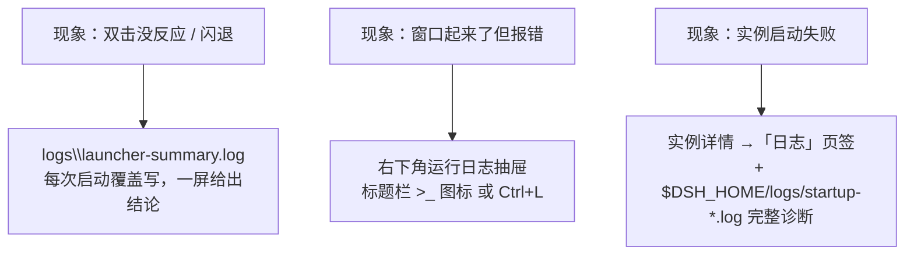
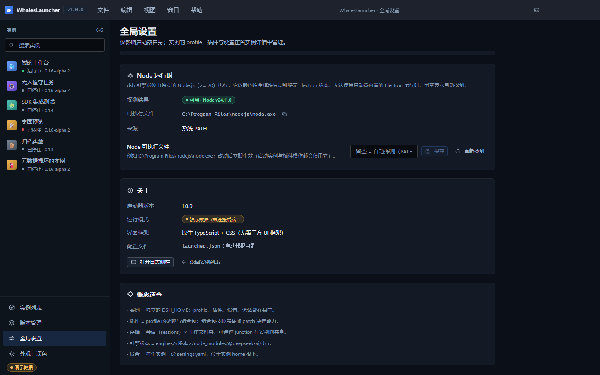
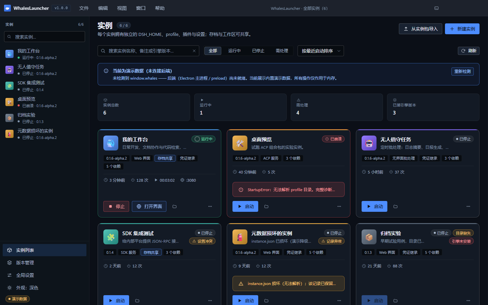

# 07 · 故障排查

> 目标：出问题时**知道先看哪里**，并且能自己定位到具体原因，而不是反复重启碰运气。

---

## 1. 排查顺序：三个地方，按这个顺序看



**为什么先看 `launcher-summary.log`**：它是唯一一份「人读的汇总结论」——
时间、入口、构建决策、实际执行的命令、退出码、Electron 日志末尾都在一屏之内。
绝大多数「双击没反应」的问题，看一眼这个文件就知道卡在哪一步了。

---

## 2. 启动器本身起不来

| 现象 | 原因 | 处理 |
|---|---|---|
| 双击 `.bat` 窗口一闪而过 / 没反应 | 构建或启动失败 | 打开 **`logs\launcher-summary.log`**，末尾会写明失败原因与下一步 |
| 提示缺少 `node_modules/electron/dist/electron.exe` | 依赖没装好，或 Electron 二进制没下载成功 | 先 `npm install`；仍失败则 `npm run setup:electron`（只用本机缓存离线铺设，不联网） |
| `npm install` 报 `EPERM ... node_cache` | shell 注入了 `npm_config_cache` 且指向工作区外，压过了项目 `.npmrc` | 显式指定缓存目录：`$env:npm_config_cache="$PWD\.npm-cache"; npm install --cache "$PWD\.npm-cache"` |
| 构建报 `spawn EPERM` | 受限环境禁止带管道 stdio 的 spawn | 构建已改用 esbuild CLI + `stdio:'inherit'`；安装用 `npm install --ignore-scripts` |
| Electron 启动即崩溃（crashpad "not connected"） | Chromium 需要命名管道与 mojo IPC，受限沙箱会禁掉 | 在**普通（非沙箱）终端**里运行 |
| 想先确认「启动链路」通不通，不开窗口 | — | `npm run launch -- --dry-run`（只做环境检查与构建判定） |

> 需要说明的是：把 `.bat` 编译成 exe **不会**解决上面任何一条 —— 它照样要调用 `node` 与
> `node_modules/electron`，只是把脚本藏进 exe，反而更难排查。所以本项目不做单文件 exe。

---

## 3. 实例启动失败

### ① `node-addon-require-builtin unsupported`

```
Error: dsh: host preparation failed: node-addon-require-builtin unsupported:
  Unsupported/no-context (unsupported Electron runtime fingerprint: ...)
```

**原因**：用来跑 dsh 的不是真正的 Node.js，而是 Electron 内置的 Node 运行时。
dsh 的原生模块按运行时指纹白名单匹配，Electron 的指纹不在名单里。

**处理**：去 **全局设置 → Node 运行时** 确认探测结果；若显示「未找到可用的 Node.js」，
手动指定 `node.exe` 的绝对路径并保存，或设环境变量 `WHALES_NODE_PATH` 后重启启动器。



*图 23：全局设置的「Node 运行时」区块。正常状态会显示「可用」、实际使用的路径与来源。*

详见 [01 安装与首次启动](01-install.md#2-为什么实例不能借用启动器自带的-node)。

### ② `EADDRINUSE ... :3080`

**原因**：端口被占用。注意启动器**已经内置了自动端口避让** ——
每个 Web 实例的端口会在 **3080–3179** 内自动避让，区间占满时回落 `--port 0` 由内核分配。
所以正常情况下你不会遇到这个错。

仍然遇到的话，通常是：

| 情况 | 处理 |
|---|---|
| 你在实例的**启动参数**里手写了 `--port 3080`，而这个端口被别的程序占了 | 改成别的端口（详情 → 设置 → 启动参数 → `--port 3081`），或在自动避让下**删掉手写的端口**让它自己选 |
| 端口被第三方程序占用 | 结束那个占用者，或按上一条换端口 |

实例失败提示里也会写清楚当前冲突的端口。

### ③ `StartupError: 无法解析 profile 目录`



*图 16：崩溃的实例卡片上直接给出错误原因横幅，不用点进去猜。*

**原因**：实例的 `home/` 被破坏（目录被移走、`profile` 被手工删掉、`package.json` 损坏等）。

**处理**：

1. 卡片 `⋯` → **打开实例目录** → 检查 `home/profiles/<profile>/` 是否存在；
2. 若刚动过引擎版本，考虑**降级/升级**导致的 profile 格式不匹配（见下一条）；
3. 实在修不回来 → 用 `⋯` → **导出实例包**留个底，再重建实例。

### ④ 引擎未安装

卡片上出现红色 `引擎未安装` 徽标：

```
本地未安装引擎 0.1.3
```

**处理**：去 **版本管理** 装上该版本；或编辑实例元数据换绑到已装版本。
用**实例包导入**得到的实例最容易出现这个 —— 包**不含 `node_modules`**，依赖要按清单在本地重装。

### ⑤ 降级后行为异常

> dsh 不同大版本之间的 profile 格式不保证兼容；把实例切换到更旧的版本前，
> 请确认 profile 结构未被新版本改写。

新版 dsh 可能已经改写了 profile 结构，旧版读不了。**处理**：换回新版本；
或从备份/实例包里恢复 profile。

---

## 4. 界面相关问题

### 看不到自己的实例，只有 6 个示例实例

界面顶部说明条写着「当前为演示数据（未连接后端）」，左下角有橙色 **演示数据** 徽标：

> 未检测到 `window.whales` —— 后端（Electron 主进程 / preload）尚未就绪。
> 当前展示内置演示数据，所有操作仅作用于内存。

**原因**：用浏览器直接打开了 `dist/renderer/index.html`（渲染层可以脱离后端独立预览，
见 [`src/renderer/PREVIEW.md`](../../src/renderer/PREVIEW.md)），或者 preload 没加载成功。

**处理**：

- 如果你是**想正常使用** → 用 `启动 WhalesLauncher.bat` 启动完整应用；
- 如果你是**在开发界面** → 这正是预期行为，点说明条上的 **重新检测** 可再探一次后端。

### 刷新界面 / 重新加载

| 操作 | 快捷键 |
|---|---|
| 刷新界面 | **F5** |
| 重新加载 | `Ctrl+R` |
| 强制重新加载（忽略缓存） | `Ctrl+Shift+R` |
| 开发者工具 | `Ctrl+Shift+I` |

这些由主进程统一接管（渲染层不重复注册，避免一次按键两次动作）。
刷新后会**停留在当前页面**（例如你正在看的实例详情），不会跳回列表。

> **如果你用的是修复前的旧版本**：F5 刷新带路由地址的界面后可能出现「外壳在、主区空白」。
> 根因是 `startRouter()` 在路由监听者注册**之前**就通知了一次首屏，
> 导致带 hash 的地址首次加载时无人挂载视图。
> 该缺陷已修复（`src/renderer/router.ts` + `src/renderer/index.ts` 调整启动顺序），
> 并纳入 `docs/assets/tutorial` 的截图链路验证（脚本会以带 hash 的地址冷启动，空白页会直接暴露）。

### 界面出现「未预期的错误」提示

界面右上角会弹出可关闭的错误提示（脚本错误 / 未处理的异步错误）。它同时会把细节写进
**运行日志抽屉**。按提示里的 `来源：信息` 定位，或直接复制整段贴进 issue。

---

## 5. 状态徽标对照表

实例卡片上的徽标是排查的第一线索：

| 徽标 | 含义 | 去哪处理 |
|---|---|---|
| `运行中` / `已停止` | 进程状态 | — |
| `已崩溃` | 上次启动异常退出 | 卡片上的错误横幅 → 详情「日志」页签 |
| `引擎未安装` | 本地没有该实例绑定的引擎版本 | [版本管理](04-engines-plugins.md#1-引擎版本管理) |
| `目录缺失` | 实例目录不存在，可能已被移动或删除 | 卡片 `⋯` → 打开实例目录；或从实例包重新导入 |
| `记录异常` | `instance.json` 损坏 / 元数据被删 / 清单损坏 | 卡片上有直接可见的原因提示条；必要时导出实例包重建 |
| `设置冲突` | 本地设置与共享设置不一致、尚未应用 | [设置页签两个按钮](05-settings-saves-logs.md#设置冲突本地-vs-共享) 二选一 |

> **「需处理」筛选**把上面这些一次收齐（筛选器与概览统计卡共用同一份判定，不会出现口径不一致）。

---

## 6. 还是没解决？

按这个顺序收集信息，能让定位快很多：

1. **`logs\launcher-summary.log`** —— 整体链路结论；
2. **实例的 `logs\startup-<时间戳>-<uuid>.log`** —— 启动失败的完整诊断（在详情 →「日志」→ 打开日志目录里）;
3. **运行日志抽屉的全文** —— 点「复制全部」；
4. **环境事实** —— Node 版本（`node -v`）、启动器版本、Windows 版本、
   以及 **全局设置 → Node 运行时** 的探测结果截图。

---

## 7. 卸载与彻底清理

| 想清理什么 | 做法 |
|---|---|
| 只删某个实例 | 卡片 `⋯` → 删除实例 → **勾选**「同时删除磁盘上的实例目录」 |
| 删除实例但保留文件 | 删除时**不勾选**（默认），文件仍在 `instances/` 下 |
| 清理共享区孤儿目录 | 共享区**不会**被自动清理（见 [06](06-isolation-sharing.md#6-删除实例时共享区会怎样)），手工删除 `shared/` 下没人再指向的目录 |
| 清掉全部实例 | 删除 `<root>/instances/` 与 `<root>/shared/` |
| 清掉引擎 | 版本管理里逐个卸载（**被实例占用时先解绑**） |
| 清掉构建产物 | `npm run clean` |
| 完全卸载启动器 | 删除整个项目目录即可。**注意**：若实例的凭证设为「继承主 home」，主 home（`~/.dsh`）不属于启动器目录，需自行处理 |

---

**回到目录** → [使用教程总览](README.md)
