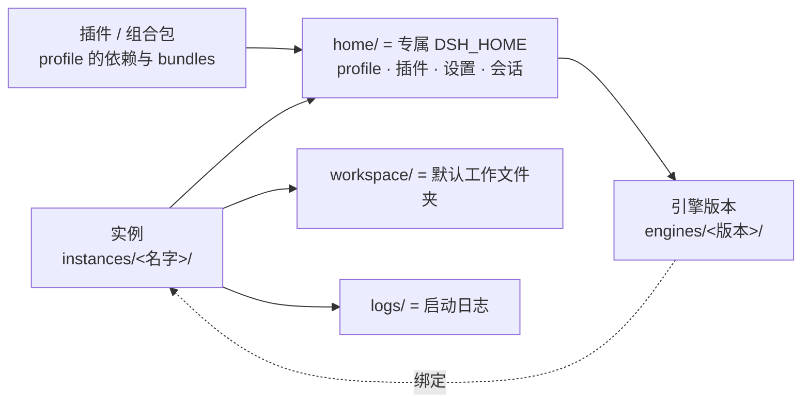

# WhalesLauncher 使用教程

> **DeepSeek Harness (dsh) 实例与版本管理启动器 · 从安装到日常使用的完整图文指引**
>
> 仓库：<https://github.com/IDKWhatID2Use/whales-launcher> · 许可证：[Polyform Noncommercial 1.0.0](../../LICENSE)

这份教程面向**使用者**：假设你没有读过源码，只想知道「怎么装起来、怎么建第一个实例、怎么让它跑起来、出问题怎么办」。
每一节都按「**做什么 → 怎么点 → 界面长什么样**」组织，关键界面都配了截图。

想要理解设计取舍（为什么这样分层、端口怎么避让、契约如何冻结），请转到
[README](../../README.md) 与 [设计文档](../design/architecture.md)；本教程只讲**怎么用**。

---

## 关于本文的截图

本文所有界面截图都是 **WinUI 3 新界面的真实运行截图**，由
[`scripts/tutorial/tour.ps1`](../../scripts/tutorial/tour.ps1) 在**隔离的临时演示 home** 上驱动应用
（真实鼠标 / 键盘输入 + UI Automation）截取，可随时重跑复现：

```powershell
node scripts\tutorial\demo-home.mjs                    # 生成演示数据（临时 home，不动你的真实数据）
node scripts\tutorial\verify-home.mjs                  # 校验后端读到的演示数据
powershell -File scripts\tutorial\tour.ps1 -PlanFile scripts\tutorial\plan-guide-a.json
```

截图用的是**临时演示实例**（`%TEMP%\whales-tutorial-home`），因此你会看到：

| 你会看到 | 含义 |
|---|---|
| 实例名「文档工作台 / 资料检索 / 数据流水线 …」 | **演示数据**，不是你的实例；你的真实 `instances/` 全程只读 |
| 路径里的 `F:\Temp\whales-tutorial-home\...` | 临时演示 home 的路径，不代表你的机器 |
| 引擎体积 `2.1 KB` | 演示 home 里用的是**桩引擎**（几行脚本，不是 dsh），用来演示「运行中 / 已崩溃」等运行时状态 |
| 6 个实例覆盖 6 种状态 | 刻意凑齐：运行中 / 已停止 / 已崩溃 / 目录缺失 / 引擎未安装 / 记录异常 |

新旧图的对应关系、每张图的数据来源与像素取证、以及旧图在 git 历史里的归档位置，
都记在 [`docs/assets/tutorial/CORRESPONDENCE.md`](../assets/tutorial/CORRESPONDENCE.md)。

---

## 三条阅读路径

挑一条走，不必从头读到尾：

| 你的情况 | 建议路径 |
|---|---|
| **第一次用，想尽快跑起来** | [01 安装与首次启动](01-install.md) → [02 五分钟上手](02-quickstart.md) |
| **已经能跑，想用全功能** | [03 实例管理](03-instances.md) → [04 引擎与插件](04-engines-plugins.md) → [05 设置·存档·日志](05-settings-saves-logs.md) |
| **多实例 / 想共享存档 / 出问题了** | [06 隔离与共享](06-isolation-sharing.md) → [07 故障排查](07-troubleshooting.md) |

---

## 章节一览

| 章节 | 讲什么 | 关键截图 |
|---|---|---|
| [01 安装与首次启动](01-install.md) | 环境要求、克隆安装、三种启动入口、Node 运行时为什么必须独立 | — |
| [02 五分钟上手](02-quickstart.md) | 装引擎 → 建实例 → 启动 → 打开界面，一条最短路径 | `17` `07`~`10` `15` |
| [03 实例管理](03-instances.md) | 列表/搜索/筛选、创建向导四步详解、编辑、删除、实例包导入导出 | `01`~`05` `19`~`22` |
| [04 引擎与插件](04-engines-plugins.md) | 多版本引擎共存、安装与卸载、组合包开关、插件装卸 | `17` `11` |
| [05 设置·存档·日志](05-settings-saves-logs.md) | `settings.yaml` 编辑器、启动参数、会话存档、实时日志 | `12` `13` `14` `06` |
| [06 隔离与共享](06-isolation-sharing.md) | 四个隔离维度、junction 原理、共享冲突怎么处理 | `10` `13` |
| [07 故障排查](07-troubleshooting.md) | 启动失败、端口占用、后端未就绪、日志在哪、常见报错对照 | `16` `06` `23` |

---

## 先认清四个概念

教程里反复出现这四个词，先花 30 秒记住它们：



| 概念 | 一句话解释 | 承载物 |
|---|---|---|
| **实例** | 一个独立运行的 dsh，互不干扰 | `instances/<实例名>/`（含专属 `home/`） |
| **引擎版本** | 实例用哪个 dsh 版本 | `engines/<版本>/node_modules/@deepseek-ai/dsh` |
| **插件 / 组合包** | 实例具备哪些能力 | profile 的 `dependencies` 与 `dsh.profile.bundles` |
| **存档** | 会话记录 × 工作文件夹，可共享 | `home/sessions/` 与 `workspace/`（可为 junction） |

> **为什么要分「实例」和「引擎版本」**：dsh 的 home 解析优先级是「显式配置 > `$DSH_HOME` > `~/.dsh`」。
> 启动器给每个实例注入自己的 `DSH_HOME`，就实现了**真正的隔离** —— 于是「升级引擎」变成一个实例自己的事，
> 不会波及别的实例。这也是本启动器存在的理由。

---

## 遇到问题先看这里

无论卡在哪一步，这三个地方按顺序看，八成能找到原因：

1. **`logs\launcher-summary.log`** —— 每次启动覆盖写，一屏给出时间、入口、构建决策、实际执行的命令、退出码结论。
   「双击没反应」时**最该先打开**的就是它。
2. **运行日志抽屉**（标题栏右上角的「运行日志」按钮，或 `Ctrl+L`）—— 实例的 stdout / stderr / 系统消息分色实时输出。
3. **实例详情 →「日志」页签** —— 启动失败时 dsh 会把完整诊断写进 `$DSH_HOME/logs/startup-<时间戳>-<uuid>.log`。

具体报错对照见 [07 故障排查](07-troubleshooting.md)。
